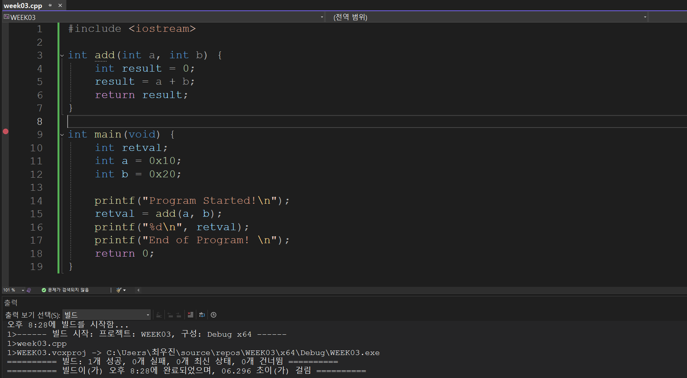

## 1. 리버싱 분석 방법
### 1.1 정적 분석
- 파일의 겉모습을 분석하는 방법
    - 파일을 실행하지 않음 
    - 파일의 종류, 크기, 헤더, 정보, 디지털 인증서 등의 다양한 내용을 확인
    - 디스어셈블러를 이용해 내부 코드와 그 구조를 확인

### 1.2 동적 분석 
- 파일을 직접 실행시켜서 그 행위를 분석하고, 디버깅을 통해 코드 흐름과 메모리 상태를 자세히 살펴보는 방법

## 2. 리틀 엔디언 표기법
> 컴퓨터에서 메모리에 데이터를 저장하는 방식을 의미 (바이트 오더링; Byte Ordering)

### 2.1 바이트 오더링(Byte Ordering)
- 일련의 데이터를 저장하는 방식
    - 바이트 오더링에는 **빅 엔디언(Big Endian)**과 **리틀 엔디언(Little Endian)**표기 두가지가 있음
    ```
    BYTE b = 0x12;
    hr0RD w = 0xL234:'
    DTORD dt/ = 0x12345678;
    char str[] = "abcde";
    ```
    - **빅 엔디언(Big Endian)**은 데이터를 저장할 때 사람이 보는 방식과 동일하게 앞에서부터 순차적으로 저장함
        - 사람이 보기엔 직관적인 편
        - 사용예시 
            - UNIX 서버에 사용되는 RISC 계열의 CPU에서 사용됨
            - 네트워크 프로토콜
    - **리틀 엔디언(Little Endian)**은 데이터를 저장할 때 역순으로 저장함
        - Intel x86 CPU에서 리틀 엔디언 방식을 사용함

## 3. Visual Studio 디버깅 방법

1. 의심 함수 앞에 breakpoint.
2. 변수 Watch에 추가.
3. 처음엔 Step Over로 큰 그림 파악.
4. 이상 징후가 보이는 호출 지점에서 Step Into.
5. 내부가 괜찮다? Step Out으로 상위로 복귀.

```nasm
; --- C:\Users\최우진\source\repos\WEEK03\WEEK03\week03.cpp -------------------------

int main(void) {
004010A0 55                   push        ebp
004010A1 8B EC                mov         ebp,esp
004010A3 83 EC 0C             sub         esp,0Ch
    ; int retval;
    ; int a = 0x10;
004010A6 C7 45 F8 10 00 00 00 mov         dword ptr [ebp-8],10h
    ; int b = 0x20;
004010AD C7 45 FC 20 00 00 00 mov         dword ptr [ebp-4],20h

    ; printf("Program Started!\n");
004010B4 68 00 21 40 00       push        402100h
004010B9 E8 82 FF FF FF       call        00401040
004010BE 83 C4 04             add         esp,4

    ; retval = add(a, b);
004010C1 8B 45 FC             mov         eax,dword ptr [ebp-4]
004010C4 50                   push        eax
004010C5 8B 4D F8             mov         ecx,dword ptr [ebp-8]
004010C8 51                   push        ecx
004010C9 E8 B2 FF FF FF       call        00401080
004010CE 83 C4 08             add         esp,8
004010D1 89 45 F4             mov         dword ptr [ebp-0Ch],eax

    ; printf("%d\n", retval);
004010D4 8B 55 F4             mov         edx,dword ptr [ebp-0Ch]
004010D7 52                   push        edx
004010D8 68 14 21 40 00       push        402114h
004010DD E8 5E FF FF FF       call        00401040
004010E2 83 C4 08             add         esp,8

    ; printf("End of Program! \n");
004010E5 68 18 21 40 00       push        402118h
004010EA E8 51 FF FF FF       call        00401040
004010EF 83 C4 04             add         esp,4

    ; return 0;
004010F2 33 C0                xor         eax,eax
}
004010F4 8B E5                mov         esp,ebp
004010F6 5D                   pop         ebp
004010F7 C3                   ret

; --- D:\a\_work\1\s\src\vctools\crt\vcstartup\src\startup\exe_common.inl --------
```
## 라인별 해설
### 함수 프롤로그 & 스택 프레임 생성 

```nasm
004010A0 55                push ebp          ; 이전 프레임 포인터 저장
004010A1 8B EC             mov  ebp, esp     ; ebp를 현재 스택 꼭대기로 설정
004010A3 83 EC 0C          sub  esp, 0Ch     ; 지역변수 12바이트 확보
```
- retval, a, b의 type이 int(4bytes) 3개 -> 12바이트(0x0C) 공간 확보
    - stack은 **높은 주소에서 낮은 주소 방향**으로 확장됨
    - sub esp, 0Ch → esp = esp - 0Ch
        - esp는 스택 포인터
- 지역변수 배치
    - [ebp-8] = a
    - [ebp-4] = b
    - [ebp-0Ch] = retval
### 3.1 Step over & Step Into 차이 
> 
1. Step Over
- 현재 줄을 실행하되, 그 줄의 함수 안으로 들어가지 않음
    - 결과만 받아서 다음 줄로 이동
2. Step Into 
- 현재 줄에서 호출한 함수의 "첫 줄"로 들어감 
    - 함수 내부 흐름을 한 줄씩 추적함

