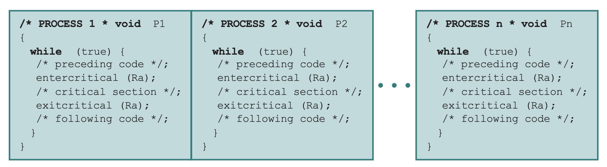

### 상호배제(mutual exclusion)란?
- 상호 배제를 보장하기 위해서는 프로세스가 인터럽트(interrupt) 되지 않도록 하면 된다.
    - 단일 프로세서 시스템에서는 동시에 여러 프로세스가 겹쳐서 실행될 수 없고, 단지 인터리빙(interleaving) 방식으로 번갈아 실행
    - 실행 중인 어떤 프로세스는 OS 서비스를 호출하거나 인터럽트를 받을 때까지 계속 실행
- OS 커널은 인터럽트 비활성화(disable interrupts) 및 활성화(enable interrupts) 기능을 제공
- 프로세스는 다음과 같은 형태로 상호 배제를 구현한다. 
```
while (true) {
    /* 인터럽트 비활성화 */
    /* 임계 구역 */
    /* 인터럽트 활성화 */
    /* 나머지 코드 */
}
```
- 위와 같이 구현하게 된다면, 임계 구역이 인터럽트를 받지 않기 때문에 상호 배제가 보장
- 단점 존재 
    - 실행 효율이 저하
    - 다중 프로세서(multiprocessor) 환경에서는 동작하지 않음
### 상호배제 해결방법

