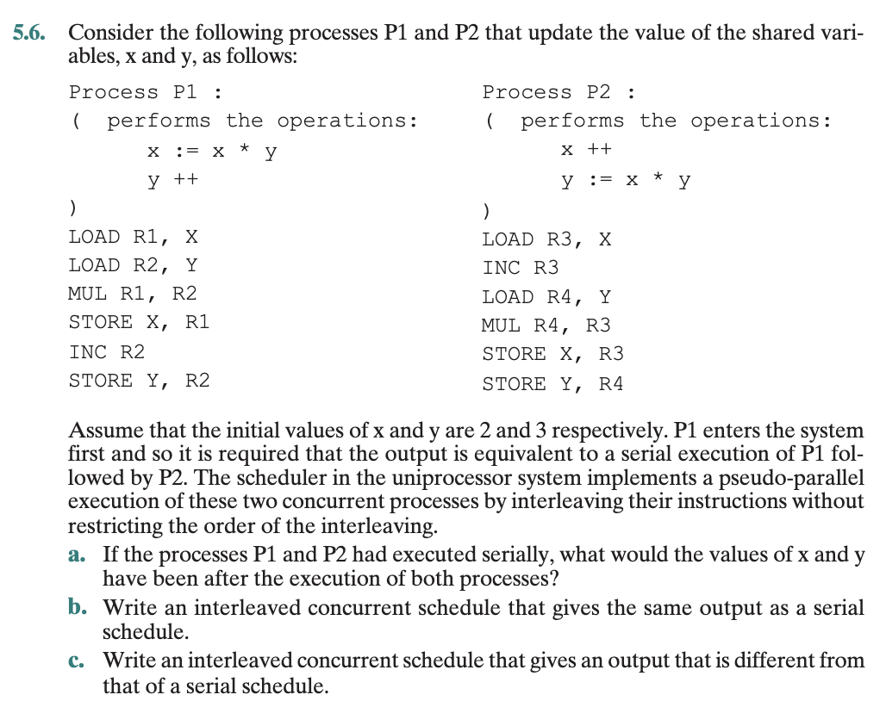

### 상호배제 (Mutual Exclusion)란?

> 한 번에 하나의 프로세스만 임계 구역(critical section)을 실행할 수 있도록 하는 원리.
- 상호 배제를 보장하기 위해서는 프로세스가 **인터럽트(interrupt)** 되지 않도록 해야 한다.
- 단일 프로세서 시스템에서는 여러 프로세스가 동시에 실행되지 않고 **인터리빙(interleaving)** 방식으로 번갈아 실행된다.
- 실행 중인 프로세스는 OS 서비스를 호출하거나 인터럽트를 받을 때까지 계속 실행된다.
- OS 커널은 인터럽트 비활성화(`disable interrupts`) 및 활성화(`enable interrupts`) 기능을 제공한다.


```
while (true) {
    /* 인터럽트 비활성화 */
    /* 임계 구역 */
    /* 인터럽트 활성화 */
    /* 나머지 코드 */
}
```

- 위 방식은 임계 구역이 인터럽트를 받지 않으므로 상호 배제가 보장된다.  
- 그러나 다음과 같은 단점이 존재한다.
  - 실행 효율 저하 (프로세스 인터리빙 제한)
  - 다중 프로세서(multiprocessor) 환경에서는 동작하지 않음  
- 따라서 이러한 한계를 보완하기 위해 다른 상호 배제 알고리즘(예: Peterson’s algorithm, Test-and-Set 등)이 사용된다.

### 상호배제 해결방법


## 연습문제 5.1

With respect to mutual exclusion using interrupt disabling

1. Mention **the requirements for this exclusion and state** which of them are met when interrupts are disabled.
- 임계영역에 접근하고자 하는 프로세스의 수행이 무한히 미루어져서는 안됨. 
- 임계영역이 empty일 때, 임계영역에 진입하려고 하는 프로세스가 지연되어서는 안 됨 
- 프로세서의 개수나 상대적인 프로세스 수행 속도에 대한 가정은 없어야 함. 
- 프로세스는 유한 시간 동안만 임계영역에 존재할 수 있음. 
2.  Identify the problems associated with this mechanism.

## 연습문제 5.3


### (a)해설 
initial values $x$와 $y$의 값이 각각 2와 3이다. 
- $P_1$에서 $x =$ $2 \times 3$ 이므로  $x = 6$이다. 
- $P_1$에서 $y + 1$이므로 $y=4$이다. 
- $P_2$에서 $x +1 $ 이므로  $x=7$이다. 
- $P_2$에서 $y = x  \times y = 6 \times 4$이므로 $y=28$이다. 

### (b)해설 

- assembly 코드를 확인해야 interleaved concurrent schedule을 확인할 수 있다. 
- 교행 수행 되었을 때 가지 수는 많음 -> 순차 실행 되었을 때와 x, y갱신된 값이 다르다 정도만 알고 넘어가면 됨.
- $P_1$에서 
    - `x := x * y` 에서 
        - `LOAD R1, X` X의 값을 R1(레지스터)에 로드 
        - `LOAD R2, Y` Y의 값을 R2(레지스터)에 로드 
        - `MUL R1, R2` R1에 R2의 값을 곱하여 R1에 갱신
        - `STORE X, R1` R1의 값을 X에 저장
    - `y++` 에서 
        - `INC R2` R2의 값을 1만큼 증가
        - `STORE Y, R2`(증가된) R2의 값을 Y에 저장
    
- $P_2$