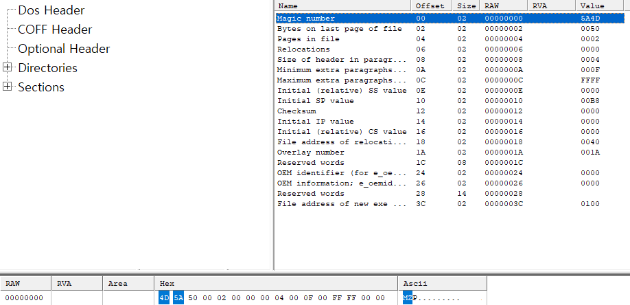
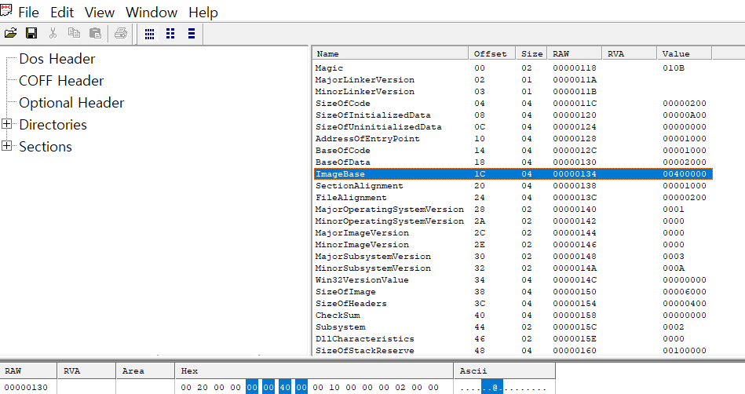

## PE 파일 형식 (Portable Executable)

> **PE(Portable Executable)** 는 실행 파일, DLL, 오브젝트 코드 등을 위한 파일 형식이다. 이름처럼 다른 곳으로 옮겨도 실행이 가능하도록 이식성을 염두에 두고 설계되었다. PE 파일은 크게 **PE 헤더**와 **섹션**으로 구성된다.

### PE 헤더 (PE Header)

PE 헤더는 파일의 메타데이터를 담고 있으며, 운영체제가 파일을 메모리에 어떻게 매핑하고 실행할지에 대한 정보를 제공한다.

#### 1. DOS 헤더 (DOS Header)

-   모든 PE 파일의 시작은 `IMAGE_DOS_HEADER` 구조체로 시작한다. 이는 MS-DOS와의 하위 호환성을 위한 부분이다.
```c
typedef struct _IMAGE_DOS_HEADER // DOS .EXE header
{
    WORD e_magic;       // Magic number
    WORD e_cblp;        // Byte on last page of file
    WORD e_cp;          // Pages in file
    WORD e_crlc;        // Relocations
    WORD e_cparhdr;     // Size of header in paragraphs
    WORD e_minalloc;    // Minimum extra paragraphs needed
    WORD e_maxalloc;    // Maximum extra paragraphs needed
    WORD e_ss;          // Initial (relative) SS value
    WORD e_sp;          // Checksum
    WORD e_ip;          // Initial IP value
    WORD e_cs;          // Initial (relative) CS value
    WORD e_lfarlc;      // File address of relocation table
    WORD e_ovno;        // Overlay number
    WORD e_res[4];      // Reserved words
    WORD e_oemid;       // OEM identifier (for e_oeminfo)
    WORD e_oeminfo;     // OEM information; e_oemid specific
    WORD e_res2[10];    // Reserved words
    LONG e_lfanew;      // File address of new exe header
} IMAGE_DOS_HEADER, *PIMAGE_DOS_HEADER;
```
-   주요 멤버 변수는 다음과 같다.
    -   `e_magic`: DOS signature로 항상 "MZ" (0x5A4D) 값을 가진다. 파일이 유효한 PE 파일인지 확인하는 첫 번째 지표이다.
    -   `e_lfanew`: NT 헤더의 시작 위치를 알려주는 오프셋 값이다. 이 값을 통해 NT 헤더로 바로 이동할 수 있다.

#### 2. DOS 스텁 (DOS Stub)

-   DOS 헤더 바로 뒤에 위치하며, PE 파일을 DOS 환경에서 실행했을 때 "This program cannot be run in DOS mode"와 같은 메시지를 출력하는 작은 프로그램이다.

#### 3. NT 헤더 (NT Headers)

-   `e_lfanew`가 가리키는 위치에 있으며, PE 파일의 핵심 정보를 담고 있다. `Signature`, `File Header`, `Optional Header` 세 부분으로 나뉜다.

    -   **Signature**: PE 포맷임을 나타내는 시그니처로, "PE\0\0" (0x00004550) 값을 가진다.

    -   **파일 헤더 (File Header)**: `IMAGE_FILE_HEADER` 구조체이며, 파일의 개략적인 정보를 담는다.
        -   `Machine`: 대상 CPU 아키텍처 (e.g., x86, x64).
        -   `NumberOfSections`: 파일에 존재하는 섹션의 개수.
        -   `TimeDateStamp`: 파일이 생성된 시간.
        -   `Characteristics`: 파일의 속성 (e.g., 실행 파일인지, DLL인지).

    -   **옵셔널 헤더 (Optional Header)**: `IMAGE_OPTIONAL_HEADER` 구조체이며, 이름과 달리 실행 파일에서는 **필수적인** 헤더이다. 프로그램 실행에 필요한 핵심 정보를 포함한다.
        -   `Magic`: PE32(0x10b) 또는 PE32+(0x20b, 64비트)를 구분한다.
        -   `AddressOfEntryPoint`: 프로그램이 처음 시작되는 코드의 주소(RVA).
        -   `ImageBase`: PE 파일이 메모리에 로드되는 시작 주소.
        -   `DataDirectory`: `IMAGE_DATA_DIRECTORY` 구조체 배열로, Import/Export 테이블, 리소스, TLS 등 중요한 데이터 구조의 위치와 크기 정보를 담고 있다.

### 섹션 (Sections)

-   헤더 다음에 위치하며, 코드, 데이터, 리소스 등 파일의 실제 내용을 담고 있다. 각 섹션은 자신의 속성을 정의하는 **섹션 헤더**를 가진다.

#### 주요 섹션 종류

-   **.text**: 실행 가능한 코드를 포함하는 섹션. 일반적으로 실행/읽기 전용 권한을 가진다.
-   **.data**: 초기화된 전역 변수 및 정적 변수를 저장하는 섹션.
-   **.rdata**: 읽기 전용 데이터 (e.g., 문자열 리터럴, 상수)를 저장한다. Import/Export 테이블 정보도 이 곳에 위치할 수 있다.
-   **.bss**: 초기화되지 않은 데이터 섹션. 파일 내에서는 공간을 차지하지 않지만, 메모리에 로드될 때 할당된다.
-   **.rsrc**: 아이콘, 이미지, 메뉴 등 프로그램에서 사용하는 리소스를 저장한다.
-   **.idata**: 다른 DLL에서 가져오는 함수 정보를 담은 Import Address Table (IAT) 등이 위치하는 섹션이다.
-   **.edata**: 다른 프로그램에서 사용할 수 있도록 함수를 노출하는 Export 정보가 담긴 섹션이다. (주로 DLL)
-   **.reloc**: ImageBase에 로드할 수 없는 경우, 코드 내의 주소를 수정하기 위한 재배치 정보를 담고 있다.

## PE Viewer로 확인 
- 사용한 PE Viewer -> VX PE Viewer ver 1.0
1. Dos header signature 확인
> Dos Header > Magic number 부분을 클릭하면 아래 HEX DUMP 창에 해당 영역에 하이라이트가 칠해진 부분을 확인할 수 있다. 
> - Magic Number가 차지하는 부분은 총 2bytes이고 signature는 `MZ`이다.


## PE 파일 로딩과 메모리

Windows가 프로세스를 메모리에 로드할 때, PE 파일의 정보를 사용하여 가상 메모리 공간에 내용을 매핑한다. 이때 운영체제는 가상 메모리의 어느 위치에, 어떤 크기로 공간을 할당해야 할지 어떻게 알 수 있을까?

그 해답은 **옵셔널 헤더(Optional Header)** 에 있다.
> 
> -   **`ImageBase`**: PE 파일이 메모리에 로드될 가상 주소(VA)의 시작점을 지정한다. 예를 들어 `ImageBase`가 `0x00400000`이라면, 로더는 이 주소부터 PE 이미지를 배치하려고 시도한다.
>    -   Hex Dump에서 이 값은 `00 00 40 00`처럼 보이는데, 이는 intel x86 아키텍처가 사용하는 **리틀 엔디안(Little Endian)** 바이트 순서 때문이다. 낮은 주소에 데이터의 가장 낮은 바이트(Least Significant Byte)부터 저장하므로, 실제 값은 `0x00400000`이 된다.

> `ImageBase`에 지정된 주소는 희망 사항(preferred address)일 뿐, 항상 그 주소에 로드된다는 보장은 없다. 만약 해당 프로세스의 가상 주소 공간에서 `ImageBase` 주소가 이미 다른 모듈(e.g., 다른 DLL)에 의해 사용 중이라면, PE 로더는 다른 비어있는 주소에 파일을 로드하게 된다. 이 과정을 **재배치(Rebasing)** 라고 하며, 이를 위해 `.reloc` 섹션의 정보가 사용된다. 