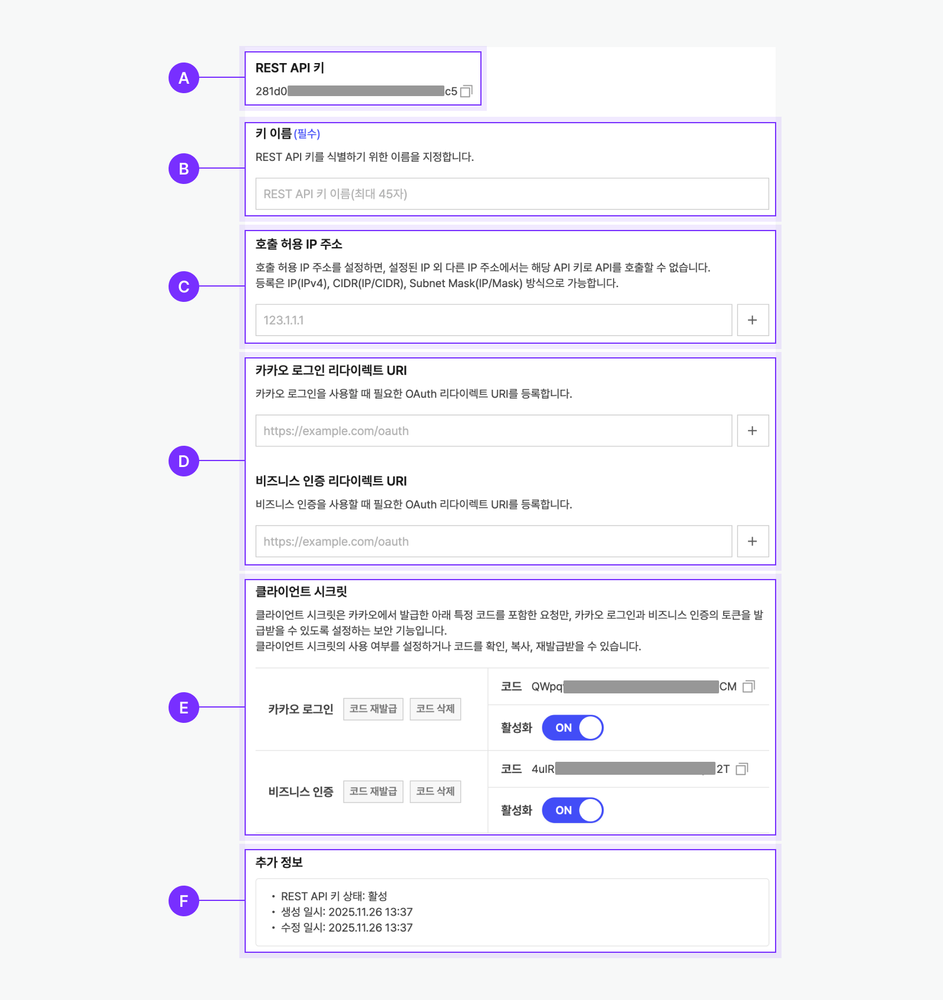
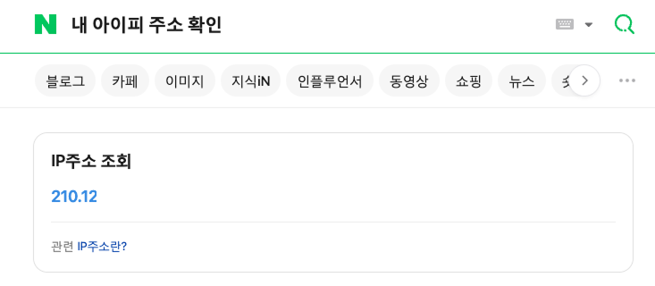
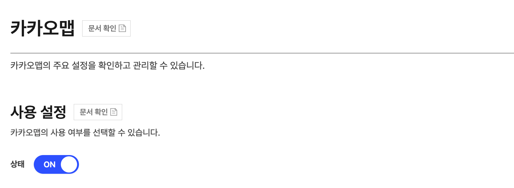

> 일단, 수집하고자하는 데이터는 다음과 같다.
법정동 코드 (한 구역에) CATEGORIES에 포함된 편의시설의 개수이다.

```python 
CATEGORIES = {
    "CS2": "편의점",
    "MT1": "대형마트",
    "PK6": "주차장",
    "BK9": "은행",
    "FD6": "음식점",
    "CE7": "카페",
    "HP8": "병원",
    "PM9": "약국",
}
```
>

- Table Header & 예시

| 법정동코드 | category_group_code | count |
| --- | --- | --- |
| 1111010100 | CS2 | 2 |
| 1111010100 | MT1 | 0 |

# 1. Kakao api key 발급
> Kakao map api를 활용할 예정이기 때문에, 앱을 등록하고 kakao api key를 발급하도록 한다. 




- 이미지 중 **C. 호출 허용 IP 주소**에 내 Public ip 주소를 입력해야 한다. 
- 가장 간단한 방법은, 
    - **네이버** > “내 아이피 주소 확인”
> 
    - Private ip를 입력하지 않도록 주의하자.

## 1.1 NotAuthorizedError 에러 
> 초반에 앱에 플랫폼 REST API 키로 사용하다가 다음과 같은 인증 에러를 마주했다.
```
{'errorType': 'NotAuthorizedError', 'message': 'App(QuadS) disabled OPEN_MAP_AND_LOCAL service.'}
수집된 장소 수: 0
```

## 1.1 에러 해결 
> 
- [앱](https://developers.kakao.com/console/app) > 제품 설정 > 카카오맵 에서 사용 설정을 ON 해주면 해결 된다.

# 2. 구성
> 전체 구성은 다음과 같다. 
1. 설정 및 공통 상수 정의
2. 좌표 기반 행정구역정보 변환 함수
3. 좌표 to 법정동 코드 함수
4. 카테고리기반 장소 수집 함수
5. 동 주소 기반 좌표 변환 함수 
6. 실행 

### 1. 설정 및 공통 상수 정의
```python
import pandas as pd
import requests
import time
import os
from dotenv import load_dotenv

load_dotenv()

KAKAO_REST_API_KEY = os.getenv("KAKAO_REST_API_KEY")

HEADERS = {
    "Authorization": f"KakaoAK {KAKAO_REST_API_KEY}"
}

ADDRESS_URL = "https://dapi.kakao.com/v2/local/search/address.json"
CATEGORY_URL = "https://dapi.kakao.com/v2/local/search/category.json"
COORD2REGION_URL = "https://dapi.kakao.com/v2/local/geo/coord2regioncode.json"

CATEGORIES = {
    "CS2": "편의점",
    "MT1": "대형마트",
    "PK6": "주차장",
    "BK9": "은행",
    "FD6": "음식점",
    "CE7": "카페",
    "HP8": "병원",
    "PM9": "약국",
}

OUTPUT_PATH = "../output/seoul_legal_dong_category_count.csv"
RADIUS = 800

print(KAKAO_REST_API_KEY)
```


### 2. 좌표 기반 행정구역정보 변환 함수
> [Kakao developers | 문서 > 로컬 > REST API > 좌표로 행정구역정보 변환](https://developers.kakao.com/docs/latest/ko/local/dev-guide)
> - 좌표계에 대한 좌표값을 받아 해당 좌표에 부합하는 **행정동, 법정동**을 얻는 API
>     - 행정동 (region_type == "H")
>     - 법정동 (region_type == "B")

```python
def coord_to_bcode(x, y, sleep=0.05):
    res = requests.get(
        COORD2REGION_URL,
        headers=HEADERS,
        params={"x": x, "y": y, "input_coord": "WGS84"}
    )

    if res.status_code != 200:
        return None

    for doc in res.json().get("documents", []):
        if doc.get("region_type") == "B":
            time.sleep(sleep)
            return doc.get("code")

    time.sleep(sleep)
    return None

```

### 3. 좌표 to 법정동 코드 함수

```python
def coord_to_bcode(x, y, sleep=0.05):
    res = requests.get(
        COORD2REGION_URL,
        headers=HEADERS,
        params={"x": x, "y": y, "input_coord": "WGS84"}
    )

    if res.status_code != 200:
        return None

    for doc in res.json().get("documents", []):
        if doc.get("region_type") == "B":
            time.sleep(sleep)
            return doc.get("code")

    time.sleep(sleep)
    return None
```


### 4. 카테고리 별 장소 수집

```python
def fetch_places(category, x, y, radius):
    page = 1
    rows = []

    while True:
        res = requests.get(
            CATEGORY_URL,
            headers=HEADERS,
            params={
                "category_group_code": category,
                "x": x,
                "y": y,
                "radius": radius,
                "page": page,
                "size": 15
            }
        ).json()

        rows.extend(res.get("documents", []))

        if res["meta"]["is_end"]:
            break

        page += 1
        time.sleep(0.05)

    return rows
```

### 5. 동 주소 ->  좌표 변환 
```python
def dong_to_coord(address, sleep=0.1):
    res = requests.get(
        ADDRESS_URL,
        headers=HEADERS,
        params={"query": address}
    )

    if res.status_code != 200:
        return None, None

    docs = res.json().get("documents", [])
    if not docs:
        return None, None

    time.sleep(sleep)
    return float(docs[0]["x"]), float(docs[0]["y"])
```

### 6. 실행
> 법정동별 카테고리 시설 수 계산 & 즉시 저장
- 커널이 종료 되더라도 이어서 실행할 수 있도록 분기 처리

```python
dong_df = pd.read_csv("../raw/legal_dong.csv")

seoul_dong_df = dong_df[
    (dong_df["시도명"] == "서울특별시") &
    (dong_df["시군구명"].notna()) &
    (dong_df["읍면동명"].notna()) &
    (dong_df["읍면동명"] != "")
].copy()

done_bcodes = set()

if os.path.exists(OUTPUT_PATH) and os.path.getsize(OUTPUT_PATH) > 0:
    done_df = pd.read_csv(OUTPUT_PATH)
    done_bcodes = set(done_df["법정동코드"].astype(str))
    print("이미 처리된 법정동 수:", len(done_bcodes))
else:
    print("기존 결과 없음 (처음 실행)")

# CSV 헤더 최초 1회만 작성
if not os.path.exists(OUTPUT_PATH):
    pd.DataFrame(
        columns=["법정동코드", "category_group_code", "count"]
    ).to_csv(OUTPUT_PATH, index=False)
    
for idx, row in seoul_dong_df.iterrows():
    bcode = str(row["법정동코드"])

    if bcode in done_bcodes:
        continue

    address = f"서울특별시 {row['시군구명']} {row['읍면동명']}"

    x, y = dong_to_coord(address)
    if x is None:
        continue

    rows_to_save = []

    for category in CATEGORIES.keys():
        places = fetch_places(category, x, y, RADIUS)

        count = 0
        for p in places:
            place_bcode = coord_to_bcode(p["x"], p["y"])
            if place_bcode == bcode:
                count += 1

        rows_to_save.append({
            "법정동코드": bcode,
            "category_group_code": category,
            "count": count
        })

    pd.DataFrame(rows_to_save).to_csv(
        OUTPUT_PATH,
        mode="a",
        header=False,
        index=False
    )

    time.sleep(0.3)
```