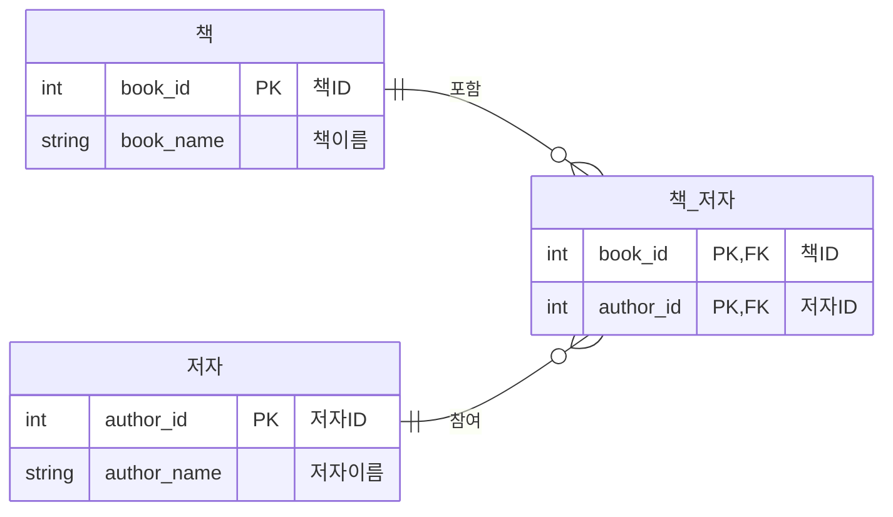
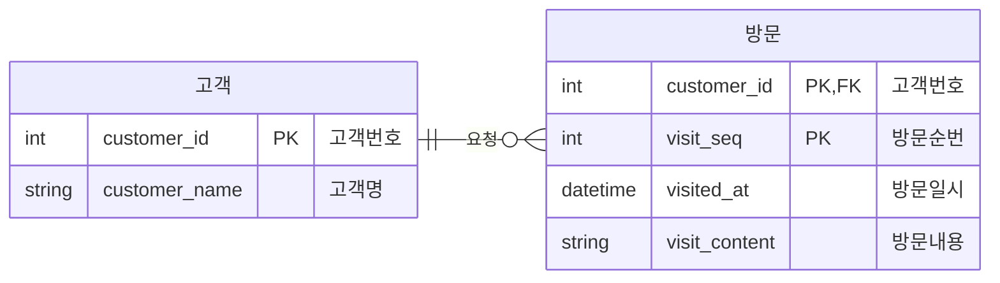
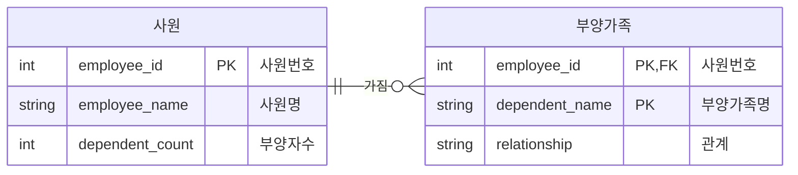
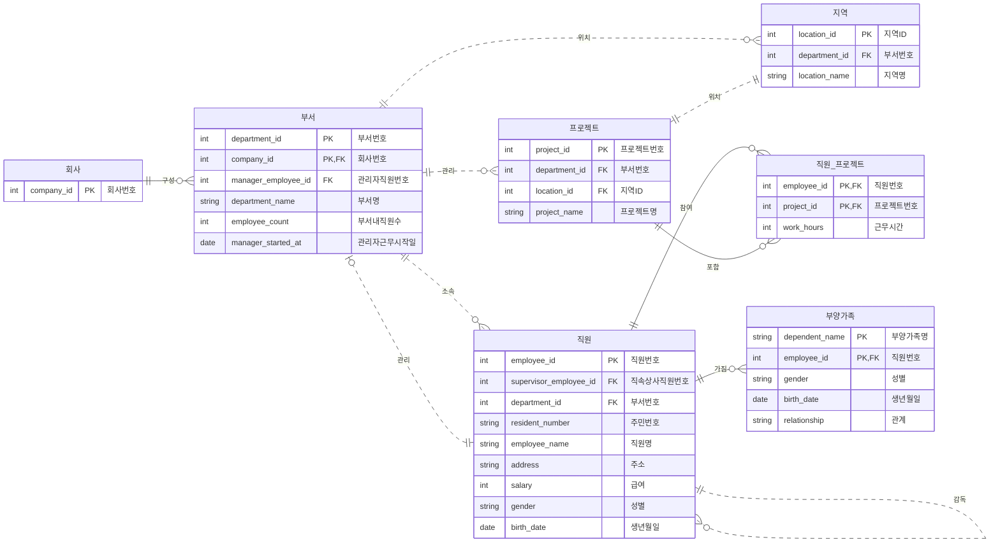
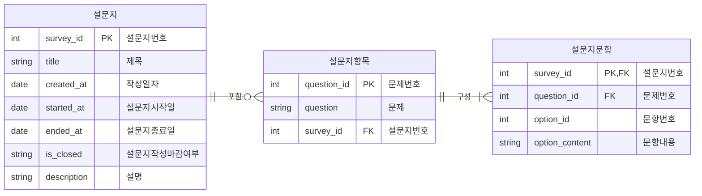

### 📍 연관 포스팅
> - [[Data Modeling] 데이터 모델링 1일차 - 개념/논리/물리 모델링과 ERD 기초](https://woojin-devv.github.io/posts/DataModeling-1/)
> - [[Data Modeling] 데이터 모델링 2일차 - 정규화, 반정규화](https://woojin-devv.github.io/posts/DataModeling-2/)

## 1. 들어가며

이번 글에서는 데이터 모델링의 기본 흐름과 ERD를 작성할 때 자주 만나는 설계 포인트를 정리한다.
데이터 모델링은 단순히 테이블을 만드는 작업이 아니라, 업무에서 관리해야 하는 데이터를 구조화하고 관계를 명확히 정의하는 과정이다.

실습 도구는 자유롭게 선택해도 되지만, 수업에서는 ERD Cloud와 ERD Editor를 기준으로 개념을 정리했다.

- 데이터 모델링의 단계
- 식별 관계와 비식별 관계
- M:N 관계 해소
- 속성의 유형
- 설계 속성과 파생 속성
- 슈퍼타입과 서브타입
- 회사/직원/프로젝트 예제와 설문지 프로젝트 예제

## 2. 데이터 모델링의 전체 흐름

데이터 모델링은 보통 개념 데이터 모델링, 논리 데이터 모델링, 물리 데이터 모델링 순서로 진행된다.
각 단계는 목적이 다르기 때문에 처음부터 컬럼 타입이나 인덱스를 고민하기보다, 먼저 업무에서 어떤 데이터가 필요한지 파악하는 것이 중요하다.

### 2.1 개념 데이터 모델링

개념 데이터 모델링은 업무에서 관리해야 하는 핵심 엔티티를 추출하고, 전체 데이터 모델의 골격을 만드는 단계다.
이 단계에서는 상세 컬럼보다는 엔티티와 엔티티 사이의 관계를 파악하는 데 집중한다.

- 핵심 엔티티 추출
- 전체 데이터 모델의 골격 생성
- 개체-관계 다이어그램 작성

### 2.2 논리 데이터 모델링

논리 데이터 모델링은 개념 모델링에서 정의한 엔티티와 관계를 바탕으로 상세 속성을 정의하는 단계다.
이 단계에서는 식별자를 확정하고, 정규화와 같은 상세화 과정을 수행한다.

- 엔티티별 상세 속성 정의
- 식별자 확정
- 정규화 수행
- 트랜잭션 인터페이스 설계

### 2.3 물리 데이터 모델링

물리 데이터 모델링은 실제 사용할 DBMS의 특성과 구현 환경을 고려해 스키마를 구체화하는 단계다.
논리 모델을 실제 테이블, 컬럼, 인덱스 구조로 변환한다.

- 컬럼의 데이터 타입과 크기 정의
- 인덱스 정의
- 성능을 고려한 역정규화 검토
- 목표 DBMS에 맞는 스키마 도출

## 3. Entity와 Relationship 설계

### 3.1 Entity 도출

엔티티는 업무에서 독립적으로 관리할 필요가 있는 데이터의 집합이다.
예를 들어 회사 관리 시스템에서는 회사, 부서, 직원, 프로젝트, 부양가족 등이 엔티티 후보가 될 수 있다.

엔티티를 도출할 때는 다음 질문을 기준으로 판단하면 좋다.

- 업무에서 독립적으로 관리해야 하는 대상인가?
- 여러 개의 인스턴스가 존재할 수 있는가?
- 속성을 가질 수 있는가?
- 다른 엔티티와 관계를 맺는가?

### 3.2 식별 관계와 비식별 관계

식별 관계와 비식별 관계는 부모 엔티티의 키가 자식 엔티티에서 어떤 역할을 하는지에 따라 구분된다.

- 식별 관계: 부모 테이블의 키가 자식 테이블로 전이되었을 때, 자식 테이블의 기본키에 포함되는 관계
- 비식별 관계: 부모 테이블의 키가 자식 테이블로 전이되었지만, 자식 테이블의 일반 외래키로만 사용되는 관계

ERD에서는 보통 식별 관계를 실선, 비식별 관계를 점선으로 표현한다.
예를 들어 부서와 사원이 있을 때, 사원이 반드시 부서의 키를 자신의 기본키로 포함해야 하는 구조라면 식별 관계가 된다.
반대로 사원 테이블이 별도의 사원번호를 기본키로 가지고, 부서번호는 소속을 나타내는 외래키로만 사용된다면 비식별 관계가 된다.

### 3.3 M:N 관계 해소

관계형 데이터베이스에서는 M:N 관계를 직접 표현하기 어렵기 때문에, 보통 중간 테이블을 만들어 1:N 관계 두 개로 분해한다.

예를 들어 책과 저자의 관계를 생각해보면, 한 권의 책은 여러 저자를 가질 수 있고 한 명의 저자도 여러 책을 쓸 수 있다.
이 경우 책과 저자 사이에 `책_저자` 같은 연결 테이블을 둔다.

다만 조회 성능을 이유로 연결 테이블에 `책이름`, `저자이름` 같은 값을 함께 저장하고 싶어질 수 있다.
하지만 이는 책 이름이 책 ID에 종속되고, 저자 이름이 저자 ID에 종속되는 구조이므로 2정규형을 위반한다.

성능 때문에 반정규화를 선택할 수는 있지만, 이 경우 데이터 중복과 무결성 문제가 발생한다.
저자 이름이 변경되었을 때 중복 저장된 값이 함께 변경되지 않으면 데이터 정합성이 깨진다.
반정규화를 적용해야 한다면 Trigger, 계산 컬럼, 배치 작업 등으로 정합성을 유지할 방법을 함께 설계해야 한다.

## 4. Attribute 설계

속성은 엔티티의 성질, 분류, 수량, 상태, 특성 등을 나타내는 세부 항목이다.
엔티티가 어떤 데이터를 보관해야 하는지 구체화하는 단계에서 속성을 정의한다.

### 4.1 기본 속성

기본 속성은 해당 엔티티가 업무적으로 원래 가지고 있는 속성이다.
예를 들어 직원 엔티티의 직원명, 주소, 급여, 성별, 생년월일 등은 기본 속성에 해당한다.

### 4.2 설계 속성

설계 속성은 원래 업무에는 존재하지 않지만, 시스템의 효율성이나 식별을 위해 임의로 추가하는 속성이다.
대표적으로 코드, 일련번호, 순번 같은 값이 있다.

예를 들어 고객센터 장애 조치 이력을 관리한다고 가정해보자.
한 고객에게 여러 번 방문할 수 있는데, 방문일자를 기본키에 포함하면 같은 날 여러 번 방문하는 경우를 표현하기 어렵다.
방문일시를 분 단위까지 늘릴 수도 있지만, 키 값이 길어지고 관리가 복잡해진다.

이럴 때 방문 순번 같은 설계 속성을 추가하면 중복을 방지하면서 방문 이력을 안정적으로 식별할 수 있다.

### 4.3 파생 속성

파생 속성은 다른 속성이나 다른 테이블의 데이터로부터 계산하거나 변형해서 얻을 수 있는 속성이다.
파생 속성은 데이터 중복과 무결성 문제를 만들 수 있기 때문에 가급적 적게 정의하는 것이 좋다.

예를 들어 사원 테이블에 `부양자수` 컬럼을 저장하는 경우를 생각해볼 수 있다.
부양자수는 부양가족 테이블에서 `COUNT(*)`로 계산할 수 있는 값이므로 파생 속성이다.

`사원.부양자수`를 별도 컬럼으로 저장하면 부양가족 데이터가 추가, 수정, 삭제될 때마다 함께 갱신해야 한다.
만약 실제 부양가족은 3명인데 사원 테이블의 부양자수가 2명이라면 데이터 정합성이 깨진 상태가 된다.

따라서 부양자수는 기본적으로 조회 시점에 계산하는 것이 적절하다.
성능상 반드시 저장해야 한다면 Trigger, Computed Column, 배치 작업 등을 통해 정합성을 유지해야 한다.

## 5. 설계 시 주의해야 할 문제

### 5.1 중복 속성 문제

방문1일시, 방문1내용, 방문2일시, 방문2내용처럼 반복되는 속성을 컬럼으로 계속 추가하는 방식은 좋지 않다.
방문 횟수가 늘어날 때마다 테이블 구조를 변경해야 하고, 조회와 관리도 어려워진다.

이런 경우 반복되는 속성을 별도의 엔티티로 분리해야 한다.
방문은 고객에 종속된 반복 데이터이므로 방문 테이블을 따로 만들고, 고객과 방문을 1:N 관계로 설계하는 것이 적절하다.

### 5.2 파생 속성의 정합성 문제

파생 속성은 편리하지만 정합성 문제가 발생하기 쉽다.
다른 테이블에서 계산 가능한 값을 컬럼으로 저장하면, 원본 데이터가 변경될 때 파생 컬럼도 함께 갱신되어야 한다.

따라서 파생 속성을 저장할 때는 다음 기준을 함께 검토해야 한다.

- 조회 성능상 정말 저장이 필요한가?
- 원본 데이터 변경 시 파생 값을 어떻게 갱신할 것인가?
- Trigger, 계산 컬럼, 배치 작업 중 어떤 방식이 적절한가?
- 데이터 불일치가 발생했을 때 검증할 수 있는가?

### 5.3 반정규화와 성능 사이의 균형

정규화는 데이터 중복을 줄이고 무결성을 높이는 데 도움이 된다.
하지만 모든 조회에서 여러 테이블 조인이 반복되면 성능 문제가 발생할 수 있다.

예를 들어 책 ID, 저자 ID, 책 이름, 저자 이름을 자주 조회해야 한다면 책, 저자, 책_저자 세 테이블을 매번 조인해야 한다.
이 경우 성능 요구사항에 따라 일부 값을 중복 저장하는 반정규화를 검토할 수 있다.

다만 반정규화는 정규화 위반을 의도적으로 감수하는 설계다.
따라서 성능 이점과 데이터 무결성 비용을 함께 판단해야 한다.

## 6. 슈퍼타입과 서브타입

슈퍼타입과 서브타입은 공통 속성과 개별 속성을 분리하기 위한 모델링 방식이다.
슈퍼타입은 공통사항을 추상화한 부모 엔티티이고, 서브타입은 구체적인 유형을 나타내는 자식 엔티티다.

예를 들어 사원이라는 공통 개념 아래에 기술직과 관리직이 있을 수 있다.
사원 테이블에는 모든 사원이 공통으로 가지는 속성을 두고, 기술직과 관리직 테이블에는 각 유형만 가지는 속성을 둔다.

배타적 관계는 슈퍼타입의 하나의 인스턴스가 여러 서브타입 중 반드시 하나의 서브타입에만 속하는 관계를 말한다.
즉, 어떤 사원은 기술직이거나 관리직이며 동시에 두 유형에 속하지 않는 구조다.

## 7. 실습 ERD 정리

### 7.1 회사-부서-직원-프로젝트 예제

다음은 회사, 부서, 직원, 프로젝트, 지역, 부양가족을 기준으로 정리한 ERD 예제다.
직원과 프로젝트는 M:N 관계이므로 `직원_프로젝트` 연결 테이블로 해소한다.

### 7.2 설문지 프로젝트 예제

설문지 프로젝트에서는 설문지, 설문지항목, 설문지문항을 엔티티로 도출할 수 있다.
하나의 설문지는 여러 항목을 가지고, 하나의 항목은 여러 문항을 가진다.

## 8. 오늘의 회고

데이터 모델링에서 중요한 것은 테이블을 빠르게 만드는 것이 아니라, 업무 규칙을 데이터 구조로 정확하게 표현하는 것이다.
특히 M:N 관계 해소, 식별 관계와 비식별 관계 구분, 파생 속성의 저장 여부는 실제 설계에서 자주 고민해야 하는 부분이다.

정규화는 데이터 무결성을 지키기 위한 기본 원칙이고, 반정규화는 성능 요구사항 때문에 선택하는 예외적인 설계다.
따라서 반정규화를 적용할 때는 중복 데이터의 정합성을 어떻게 유지할지까지 함께 설계해야 한다.

## 참고자료

- [DB - 개체 간의 관계들](https://medium.com/@atmega328mu/db-%EA%B0%9C%EC%B2%B4-%EA%B0%84%EC%9D%98-%EA%B4%80%EA%B3%84%EB%93%A4-e712303b76fb)
