### 📍 연관 포스팅
> - [[Data Modeling] 데이터 모델링 1일차 - 개념/논리/물리 모델링과 ERD 기초](https://woojin-devv.github.io/posts/DataModeling-1/)
> - [[Data Modeling] 데이터 모델링 2일차 - 정규화, 반정규화](https://woojin-devv.github.io/posts/DataModeling-2/)

## 1. 들어가며

이번 글에서는 데이터 모델링에서 속성과 식별자를 정의하는 방법을 복습하고, 정규화와 반정규화의 핵심 개념을 정리한다.
1일차에서 엔티티와 관계를 도출하는 흐름을 봤다면, 2일차에서는 테이블 구조를 더 안정적으로 만드는 방법과 성능을 위해 의도적으로 구조를 바꾸는 방법을 다룬다.

- 속성의 유형
- 슈퍼타입과 서브타입
- 재귀적 관계
- 복합키와 대체키
- 정규화
- 반정규화
- 컬럼/테이블 반정규화 패턴

## 2. 모델링 속성과 식별자 복습

데이터 모델링에서 엔티티를 도출한 뒤에는 각 엔티티가 가져야 할 속성과 식별자를 정의해야 한다.
속성은 엔티티를 설명하는 세부 데이터이고, 식별자는 엔티티의 인스턴스를 유일하게 구분하는 기준이다.

### 2.1 Attribute

속성은 크게 기초 속성, 추출 속성, 설계 속성으로 나눌 수 있다.

| 유형      | 의미                                                           | 예시                       |
| --------- | -------------------------------------------------------------- | -------------------------- |
| 기초 속성 | 엔티티가 업무적으로 원래 가지고 있는 속성                      | 이름, 생년월일, 주소       |
| 추출 속성 | 기초 속성으로부터 계산, 집계, 가공해서 얻을 수 있는 속성       | 총금액, 평균점수, 누적금액 |
| 설계 속성 | 실제 업무에는 없지만 시스템 효율을 위해 설계자가 부여하는 속성 | 순번, 코드, 상태값         |

추출 속성과 설계 속성은 편리하지만 데이터 중복과 무결성 문제를 만들 수 있다.
따라서 단순히 조회가 편하다는 이유만으로 추가하기보다는, 정합성을 유지할 방법까지 함께 설계해야 한다.

### 2.2 데이터 모델링 과정

데이터 모델링은 보통 다음 흐름으로 진행된다.

1. 업무 요구사항 분석
2. 핵심 엔티티 도출
3. 엔티티 간 관계 정의
4. 속성 정의
5. 식별자 정의
6. 정규화 수행
7. 물리 모델 변환
8. 성능 요구사항에 따른 반정규화 검토

## 3. 슈퍼타입과 서브타입

슈퍼타입과 서브타입은 공통 속성과 개별 속성을 분리해서 표현하는 모델링 방식이다.
슈퍼타입은 공통 속성을 가지는 상위 엔티티이고, 서브타입은 특정 유형에만 필요한 속성을 가지는 하위 엔티티다.

예를 들어 상품이라는 공통 개념 아래에 온라인상품, 오프라인상품, B2B상품 같은 유형이 있을 수 있다.
이때 상품명, 가격, 재고처럼 공통으로 필요한 속성은 `상품`에 두고, 유형별 속성은 각 서브타입에 둔다.

### 3.1 포함 관계 제약조건

서브타입 관계를 실제 테이블에 반영할 때는 제약조건을 통해 최소 하나의 유형에 속하도록 강제할 수 있다.

```sql
CREATE TABLE product (
  product_id   VARCHAR(10) PRIMARY KEY,
  product_name VARCHAR(100) NOT NULL,
  price        DECIMAL(10,2),
  stock        INT DEFAULT 0,
  online_yn    CHAR(1) DEFAULT 'N',
  offline_yn   CHAR(1) DEFAULT 'N',
  b2b_yn       CHAR(1) DEFAULT 'N',
  CONSTRAINT chk_at_least_one
    CHECK (online_yn = 'Y' OR offline_yn = 'Y' OR b2b_yn = 'Y')
);
```

위 제약조건은 하나의 상품이 온라인, 오프라인, B2B 중 최소 하나의 채널에는 반드시 속하도록 보장한다.

## 4. 재귀적 관계

재귀적 관계는 하나의 엔티티가 자기 자신과 관계를 맺는 구조다.
같은 테이블 안에서 특정 행의 FK가 다시 같은 테이블의 PK를 참조한다.

대표적인 예시는 직원과 직속 상사의 관계다.
직원도 같은 직원 테이블에 존재하고, 직속 상사도 같은 직원 테이블에 존재한다.

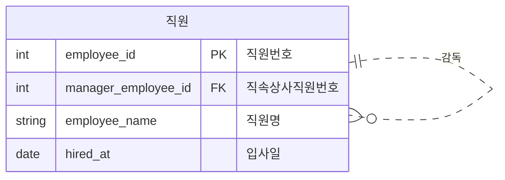

재귀적 관계를 설계할 때는 최상위 데이터의 FK를 `NULL`로 허용할지, 별도의 루트 데이터를 둘지 같은 규칙도 함께 정해야 한다.

## 5. 복합키와 대체키

식별자를 설계할 때는 복합키를 사용할지, 순번 기반의 대체키를 사용할지 결정해야 한다.
실무에서는 `순번키 + UNIQUE 복합키` 패턴을 많이 사용한다.
순번키로 참조를 단순하게 만들고, 업무적으로 중복되면 안 되는 조합은 UNIQUE 제약조건으로 보장하는 방식이다.

### 5.1 복합키를 고려할 때

복합키는 관계 자체가 식별자가 되는 경우에 적합하다.
특히 M:N 관계를 해소하기 위한 중간 테이블에서 자주 사용한다.

- 관계 자체가 키인 경우
- 중간 테이블
- 변경 가능성이 거의 없는 경우
- 좋아요, 수강신청, 주문상세 같은 데이터

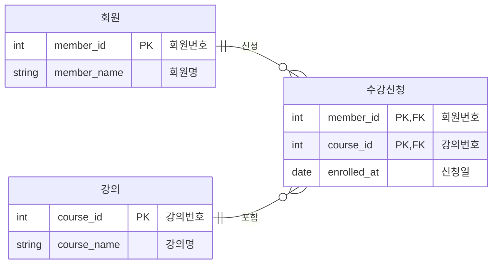

### 5.2 순번키를 고려할 때

순번키는 대부분의 일반 엔티티에 적합하다.
업무 속성이 바뀔 가능성이 있거나, 외부 테이블에서 자주 참조되는 테이블이라면 대체키를 두는 편이 관리하기 쉽다.

- 대부분의 일반 테이블
- 식별 속성 변경 가능성이 있는 경우
- 확장 가능성을 고려해야 하는 경우
- 회원, 주문, 게시판, 상품 같은 데이터

## 6. 정규화

정규화는 1972년 E. F. Codd가 제안한 이론으로, 데이터를 체계적으로 구조화해서 중복을 줄이고 이상현상을 제거하기 위한 방법이다.
정규화는 데이터 무결성을 높이는 방향의 설계다.

### 6.1 정규화가 필요한 이유

정규화가 필요한 이유는 크게 두 가지다.

1. 엔티티를 구성하는 속성 간 중복을 제거해 데이터베이스를 최적화한다.
2. 속성 간 함수 종속성 때문에 발생하는 이상현상을 제거한다.

이상현상은 다음 세 가지로 나눌 수 있다.

| 이상현상  | 의미                                                            |
| --------- | --------------------------------------------------------------- |
| 입력 이상 | 불필요한 데이터가 있어야만 원하는 데이터를 입력할 수 있는 문제  |
| 수정 이상 | 같은 의미의 데이터를 여러 곳에서 모두 수정해야 하는 문제        |
| 삭제 이상 | 특정 데이터를 삭제할 때 보존해야 할 정보까지 함께 사라지는 문제 |

예를 들어 주문 테이블에 제품 정보까지 함께 저장되어 있다면, 주문이 발생해야만 제품 정보를 등록할 수 있다.
또한 제품의 재고 수량이 여러 주문 행에 중복 저장되어 있다면, 재고를 바꿀 때 여러 행을 모두 수정해야 한다.
특정 제품의 마지막 주문 내역을 삭제하면 제품 정보까지 사라지는 문제도 생길 수 있다.

### 6.2 제1정규형

제1정규형은 모든 속성이 원자값을 가져야 한다는 규칙이다.
하나의 컬럼에 여러 값을 넣거나 반복 속성을 두면 안 된다.

- 모든 속성은 하나의 값만 가진다.
- 복수 값을 가지는 속성은 별도 엔티티로 분리한다.
- 반복되는 컬럼은 행으로 전환한다.

### 6.3 제2정규형

제2정규형은 기본키 전체에 종속되지 않는 속성을 분리하는 단계다.
특히 복합키를 사용하는 테이블에서 부분 종속이 발생할 수 있다.

예를 들어 `주문번호 + 제품번호`가 PK인 주문상세 테이블에 제품명이 들어 있다면, 제품명은 전체 키가 아니라 제품번호에만 종속된다.
이 경우 제품명은 제품 테이블로 분리해야 한다.

### 6.4 제3정규형

제3정규형은 일반 속성에 종속되는 속성을 분리하는 단계다.
즉, 기본키가 아닌 속성에 다른 속성이 종속되는 이행 종속을 제거한다.

현업에서는 보통 제3정규형까지 진행한 뒤, 성능 요구사항에 따라 반정규화를 검토하는 경우가 많다.

### 6.5 BCNF

BCNF는 결정자가 후보키가 아닌 경우를 제거하는 더 강한 정규화 형태다.
다수의 주식별자가 복잡하게 얽힌 경우 추가로 검토할 수 있다.

## 7. 반정규화

반정규화는 조회 성능을 높이거나 운영 편의성을 확보하기 위해 정규화된 구조를 의도적으로 일부 중복시키는 설계다.
정규화가 무결성을 우선한다면, 반정규화는 성능과 사용성을 위해 무결성 관리 비용을 감수하는 선택이다.

반정규화를 적용할 때는 반드시 다음 질문을 해야 한다.

- 어떤 조회 성능 문제가 있는가?
- 조인을 줄이는 것 외에 인덱스로 해결할 수 있는가?
- 중복 데이터의 정합성은 어떻게 보장할 것인가?
- Trigger, 계산 컬럼, 배치, 애플리케이션 로직 중 어떤 방식으로 동기화할 것인가?

## 8. 컬럼 반정규화

컬럼 반정규화는 테이블은 유지하되, 조회 성능이나 복구 편의성을 위해 컬럼을 추가하는 방식이다.

대표적인 유형은 다음과 같다.

1. 중복 컬럼 추가
2. 파생 컬럼 추가
3. 이력 컬럼 추가
4. PK 컬럼 분리
5. 데이터 복구를 위한 컬럼 추가

### 8.1 중복 컬럼 추가

지점명은 업무지점 테이블에 존재하지만, 사원정보를 조회할 때마다 지점명까지 자주 필요하다면 사원정보에 지점명을 중복 저장하는 방식을 검토할 수 있다.

정규화된 구조는 다음과 같다.

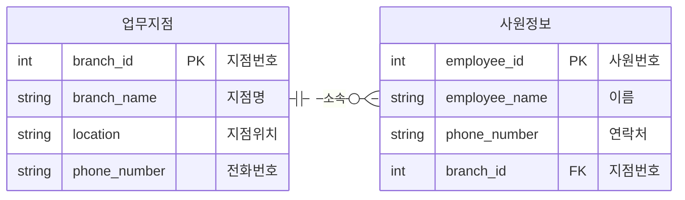

반정규화를 적용하면 사원정보에 지점명을 중복 저장한다.

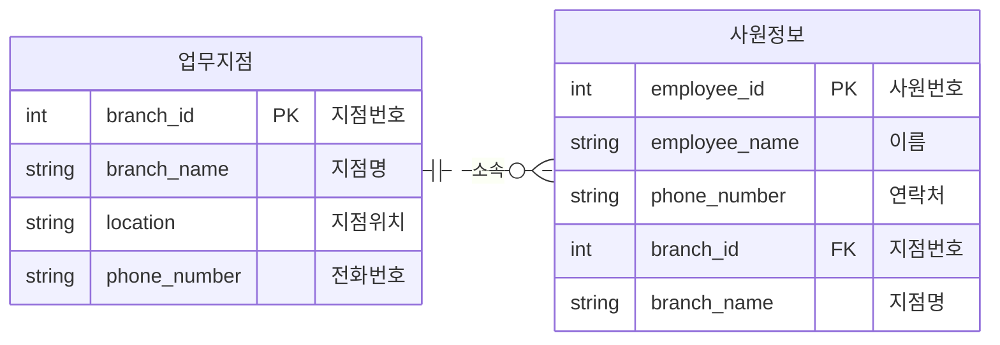

이렇게 하면 조회 시 조인을 줄일 수 있지만, 업무지점의 지점명이 변경될 때 사원정보의 지점명도 함께 갱신해야 한다.

### 8.2 파생 컬럼 추가

주문 총금액은 주문상세의 수량과 제품 단가를 통해 계산할 수 있다.
원칙적으로는 조회 시 계산할 수 있지만, 대부분의 조회에서 총금액이 필요하고 계산 비용이 크다면 주문 테이블에 총금액을 저장할 수 있다.

정규화된 구조는 다음과 같다.

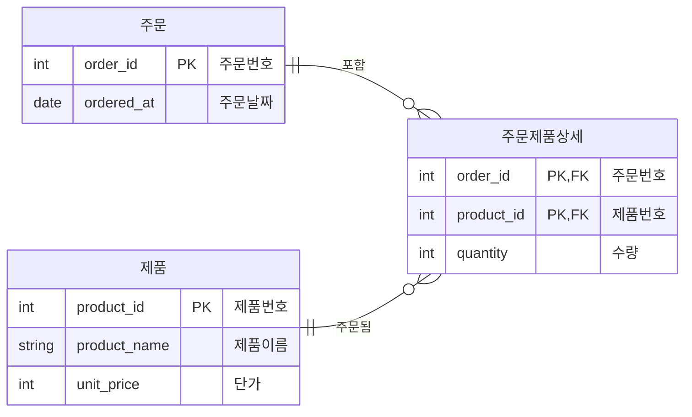

반정규화를 적용하면 주문 테이블에 총금액 컬럼을 추가한다.

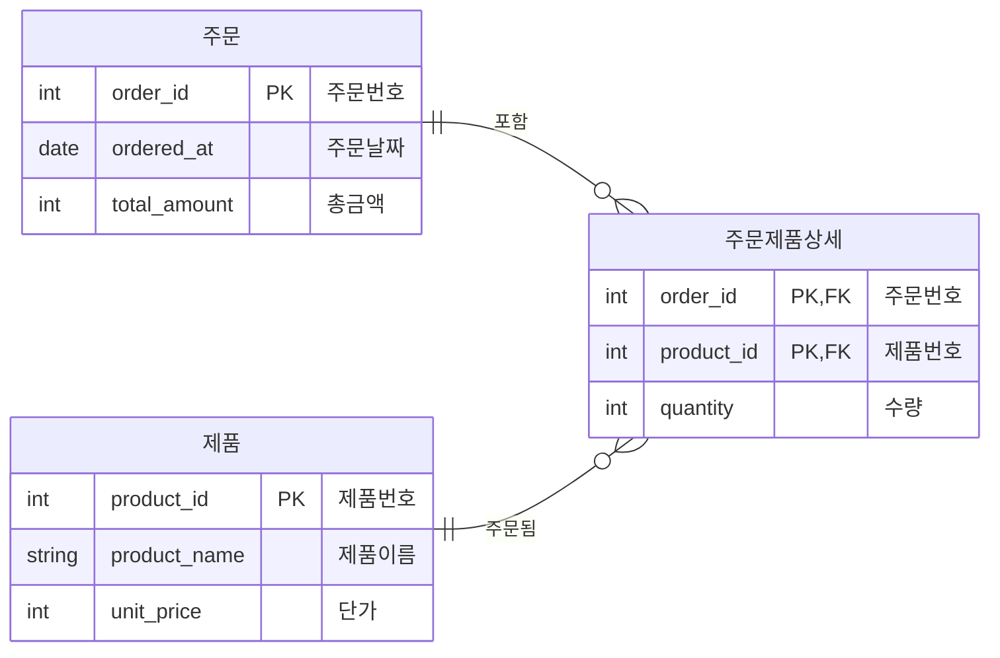

파생 컬럼을 저장할 때는 계산된 컬럼을 사용해 정합성을 확보할 수 있다.

```sql
ALTER TABLE emp ADD (totalsum NUMBER)
GENERATED ALWAYS AS (sal + NVL(comm, 0));
```

### 8.3 누적합 컬럼 주의

공사비 누적처럼 행 단위로 누적합을 저장하는 방식은 RDB 설계에서는 피하는 것이 좋다.
특정 중간 행의 공사비가 변경되면 이후 모든 누적값을 다시 계산해야 하기 때문이다.

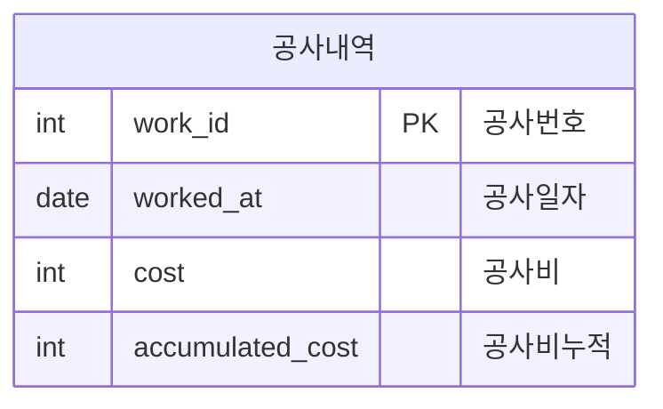

누적합은 조회 시 윈도우 함수나 집계 쿼리로 계산하는 편이 안전하다.

### 8.4 최근 등록 여부 컬럼

직원의 차량 이력을 관리할 때 최근 등록 차량만 자주 조회한다면, 매번 Top N Query를 사용하는 대신 `최근등록여부` 컬럼을 둘 수 있다.
새 차량 이력이 등록되면 기존 최근 값은 `N`으로 바꾸고, 새 이력은 `Y`로 저장한다.

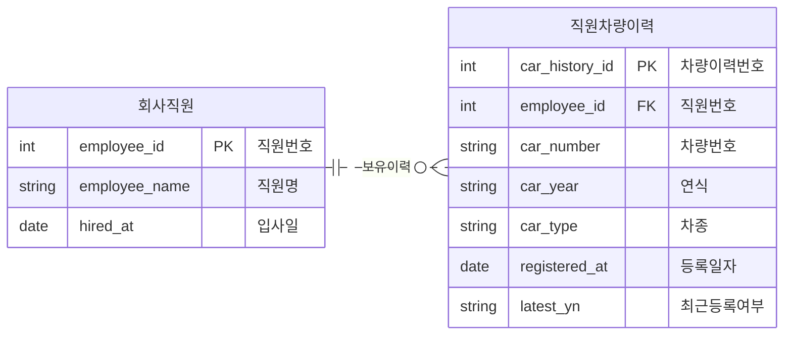

이 방식도 조회 성능은 좋아지지만, 최신 여부를 갱신하는 로직이 반드시 필요하다.

### 8.5 PK 분리 컬럼 반정규화

차량번호 안에 지역 정보가 포함되어 있더라도, 지역별 조회가 자주 발생한다면 지역을 별도 컬럼으로 분리할 수 있다.
이는 PK에 포함된 의미를 조회 성능을 위해 컬럼으로 분리하는 반정규화다.

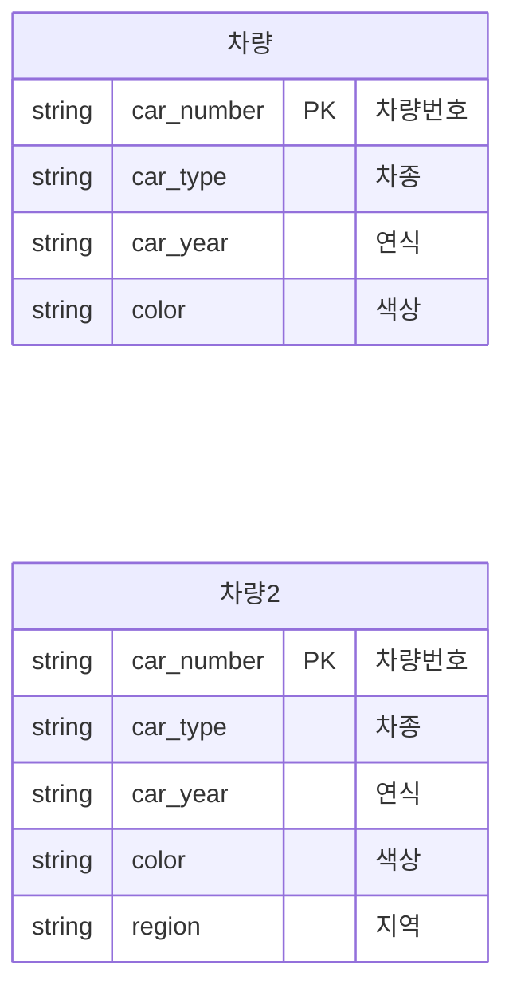

### 8.6 데이터 복구를 위한 컬럼 추가

현재 주소만 저장하면 주소 변경 이력을 복구하기 어렵다.
이전 값을 보관해야 하는 요구사항이 있다면 이전주소 같은 컬럼을 추가할 수 있다.

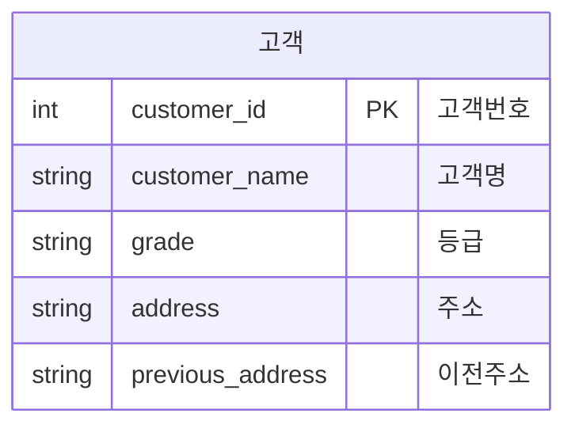

단, 이력이 여러 건 필요하다면 `이전주소` 컬럼 하나를 추가하기보다 주소 이력 테이블을 별도로 두는 방식이 더 적절하다.

## 9. 테이블 반정규화

테이블 반정규화는 컬럼이 아니라 테이블 구조 자체를 조정하는 방식이다.

대표적인 방식은 다음과 같다.

- 관계 병합
- 테이블 분할
- 중복 테이블 추가
- 통계 테이블 추가
- 이력 테이블 추가
- 부분 테이블 추가

### 9.1 슈퍼타입과 서브타입 유지

슈퍼타입과 서브타입을 그대로 분리하면 공통 속성과 개별 속성을 명확히 나눌 수 있다.

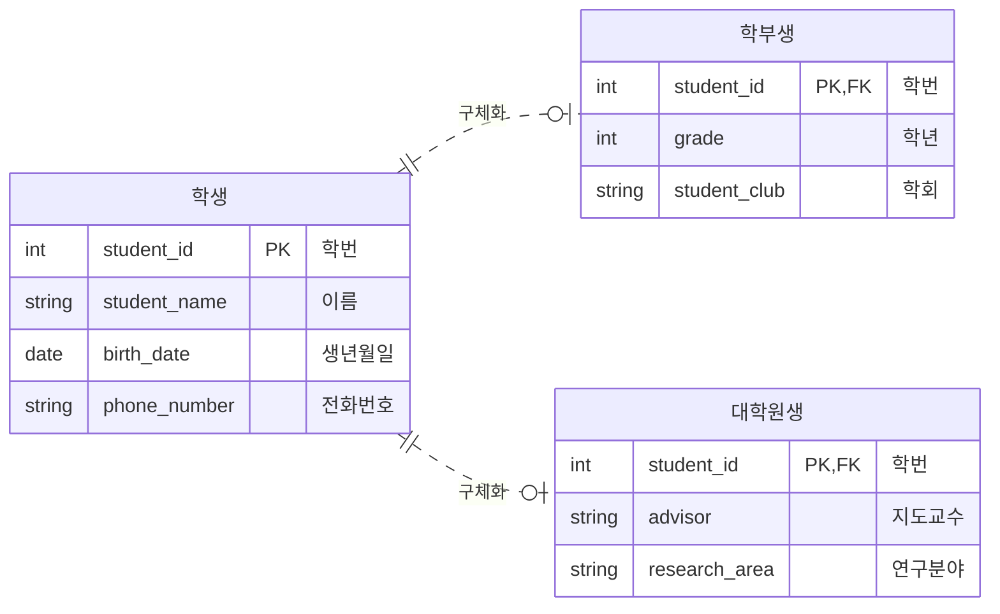

이 방식은 정규화 관점에서 명확하지만, 학생의 전체 정보를 조회할 때 조인이 필요하다.

### 9.2 1:1 One To One

서브타입별 테이블에 공통 속성까지 모두 포함하는 방식이다.
학부생과 대학원생을 완전히 별도 테이블로 관리한다.

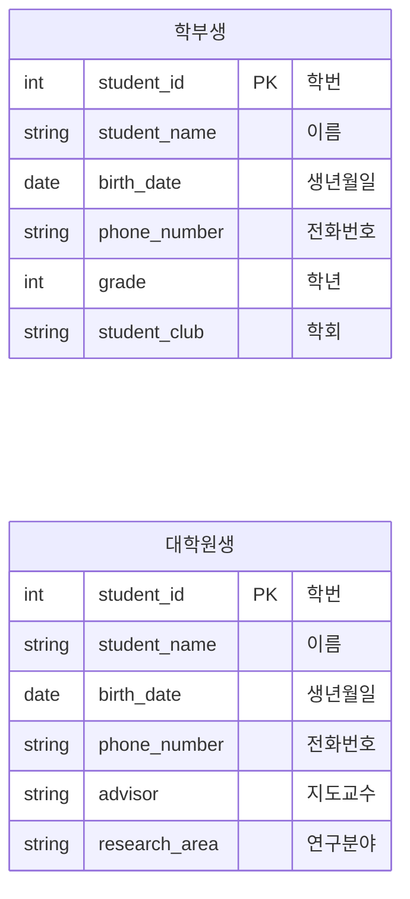

유형별 조회는 단순하지만, 공통 속성이 중복된다.

### 9.3 All In One Single Type

모든 속성을 하나의 테이블에 넣고 학생 유형에 따라 필요한 컬럼만 사용하는 방식이다.

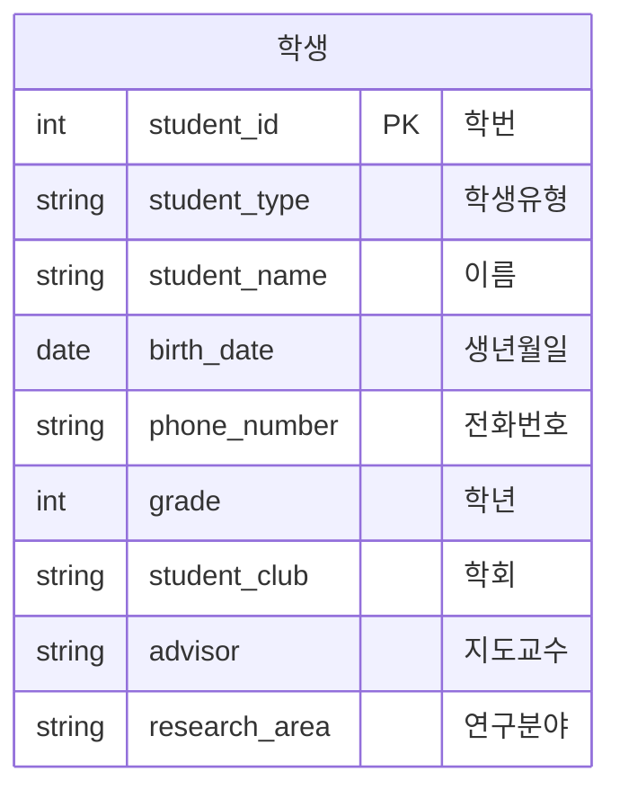

조인이 없어 조회가 단순하지만, 특정 유형에만 필요한 컬럼은 `NULL`이 많아질 수 있다.

## 10. 정리

정규화는 데이터 중복과 이상현상을 줄이기 위한 기본 원칙이다.
반정규화는 정규화 원칙을 일부 깨더라도 조회 성능이나 운영 편의성을 확보해야 할 때 선택하는 설계다.

중요한 것은 반정규화를 적용할 때마다 데이터 무결성을 어떻게 유지할 것인지 함께 결정하는 것이다.
중복 컬럼, 파생 컬럼, 최근 여부 컬럼은 모두 성능에는 도움이 될 수 있지만, 갱신 로직이 없으면 데이터 정합성을 깨뜨릴 수 있다.

따라서 모델링 단계에서는 정규화를 먼저 적용하고, 실제 조회 패턴과 성능 요구사항을 확인한 뒤 필요한 부분에만 반정규화를 적용하는 것이 좋다.
