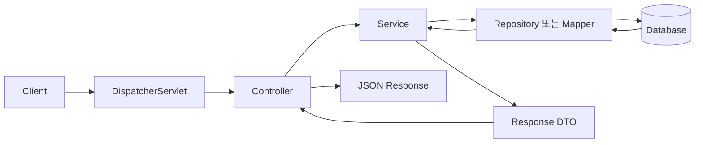

## 1. Spring Boot란?

Spring Boot는 Spring 기반 애플리케이션을 빠르게 시작하고 실행할 수 있도록 도와주는 도구다.

기존 Spring 프로젝트에서는 라이브러리 버전, 웹 서버, Bean 설정 등을 직접 맞춰야 하는 경우가 많았다. Spring Boot는 자주 사용하는 구성을 미리 묶고 합리적인 기본값을 제공해 초기 설정을 줄여 준다.

Spring Boot의 핵심을 세 가지로 정리하면 다음과 같다.

- **Starter**: 기능별로 필요한 의존성을 묶어서 제공한다.
- **자동 설정**: classpath의 라이브러리와 사용자가 등록한 Bean을 기준으로 필요한 설정을 적용한다.
- **내장 서버**: 별도의 WAS에 배포하지 않고 애플리케이션을 바로 실행할 수 있다.

Spring Boot는 Spring을 대체하는 프레임워크가 아니다. Spring의 IoC Container, DI, MVC 같은 기능을 더 편리하게 설정하고 실행하도록 돕는 방식이다.

## 2. 프로젝트 생성과 Starter

웹 애플리케이션을 만들 때는 보통 Spring Initializr에서 다음 의존성을 선택한다.

- Spring Web
- Validation
- Lombok
- Spring Data JPA 또는 MyBatis
- 사용하는 DB Driver

Gradle을 사용하는 웹 프로젝트의 최소 의존성 예시는 다음과 같다.

```groovy
dependencies {
    implementation 'org.springframework.boot:spring-boot-starter-web'
    implementation 'org.springframework.boot:spring-boot-starter-validation'
    testImplementation 'org.springframework.boot:spring-boot-starter-test'
}
```

`spring-boot-starter-web`은 Spring MVC, JSON 변환, 내장 웹 서버 등 웹 개발에 필요한 의존성을 함께 가져온다. 개별 라이브러리의 호환 버전을 하나씩 지정하는 부담이 줄어든다.

## 3. 시작 클래스와 `@SpringBootApplication`

```java
package com.example.demo;

import org.springframework.boot.SpringApplication;
import org.springframework.boot.autoconfigure.SpringBootApplication;

@SpringBootApplication
public class DemoApplication {

    public static void main(String[] args) {
        SpringApplication.run(DemoApplication.class, args);
    }
}
```

`@SpringBootApplication`은 다음 세 가지 역할을 합친 어노테이션이다.

| 어노테이션 | 역할 |
| --- | --- |
| `@SpringBootConfiguration` | 해당 클래스를 설정 클래스로 등록 |
| `@EnableAutoConfiguration` | 조건에 맞는 자동 설정 활성화 |
| `@ComponentScan` | 현재 패키지와 하위 패키지의 컴포넌트 탐색 |

시작 클래스는 일반적으로 프로젝트의 최상위 패키지에 둔다. 그래야 `controller`, `service`, `repository` 같은 하위 패키지가 컴포넌트 스캔 범위에 자연스럽게 포함된다.

```text
com.example.demo
├── DemoApplication.java
├── controller
├── service
├── repository
├── domain
└── dto
```

## 4. 자동 설정은 어떻게 동작할까?

자동 설정은 **현재 프로젝트에 어떤 라이브러리가 있는지**, **사용자가 어떤 Bean을 이미 등록했는지**, **설정값이 존재하는지** 등을 조건으로 동작한다.

예를 들어 `spring-boot-starter-web`을 추가하면 Spring Boot는 웹 애플리케이션에 필요한 기본 구성을 적용하고 내장 서버를 준비한다. 사용자가 같은 역할의 Bean을 직접 등록하면 일부 자동 설정은 물러나고 사용자의 설정을 우선한다.

즉, 자동 설정은 모든 것을 무조건 생성하는 기능이 아니라 조건에 따라 적용되는 기본 설정이다.

적용된 자동 설정을 확인하고 싶다면 애플리케이션 실행 시 `--debug` 옵션을 사용할 수 있다.

```bash
./gradlew bootRun --args='--debug'
```

## 5. 요청 처리 흐름

간단한 게시글 조회 API를 계층별로 나눠 보자.

```text
HTTP Request
  → Controller
  → Service
  → Repository
  → Database
  → HTTP Response
```

### Controller

```java
@RestController
@RequestMapping("/api/posts")
public class PostController {

    private final PostService postService;

    public PostController(PostService postService) {
        this.postService = postService;
    }

    @GetMapping("/{id}")
    public PostResponse findById(@PathVariable long id) {
        return postService.findById(id);
    }
}
```

Controller는 HTTP 요청을 받고 응답을 반환한다. 비즈니스 로직이나 DB 접근 코드를 직접 작성하기보다는 입력을 해석하고 Service에 작업을 위임하는 역할에 집중한다.

### Service

```java
@Service
public class PostService {

    private final PostRepository postRepository;

    public PostService(PostRepository postRepository) {
        this.postRepository = postRepository;
    }

    @Transactional(readOnly = true)
    public PostResponse findById(long id) {
        Post post = postRepository.findById(id)
            .orElseThrow(() -> new PostNotFoundException(id));

        return PostResponse.from(post);
    }
}
```

Service는 비즈니스 규칙과 트랜잭션의 경계를 담당한다. 여러 Repository 호출이 하나의 작업으로 성공하거나 실패해야 한다면 `@Transactional`로 묶는다.

### Repository

```java
public interface PostRepository extends JpaRepository<Post, Long> {
}
```

Repository는 데이터 저장소 접근을 담당한다. JPA 대신 MyBatis를 사용한다면 이 위치에 Mapper 인터페이스를 둘 수 있다.

## 6. 의존성 주입과 Bean

`@Controller`, `@Service`, `@Repository`, `@Component`가 붙은 클래스는 컴포넌트 스캔을 통해 Spring Bean으로 등록된다.

Spring은 Bean 사이의 의존 관계를 확인하고 필요한 객체를 주입한다. 생성자 주입을 사용하면 의존성이 명확하고 테스트하기 쉬우며, 필드를 `final`로 유지할 수 있다.

```java
@Service
public class OrderService {

    private final OrderRepository orderRepository;

    public OrderService(OrderRepository orderRepository) {
        this.orderRepository = orderRepository;
    }
}
```

직접 `new OrderRepository()`를 호출하지 않아도 Spring Container가 생성한 객체를 전달한다. 이를 통해 객체 생성과 연결 책임을 애플리케이션 코드에서 분리할 수 있다.

## 7. 요청 데이터 받기

### 경로 변수와 쿼리 파라미터

```java
@GetMapping("/{id}")
public PostResponse find(
    @PathVariable long id,
    @RequestParam(defaultValue = "false") boolean includeComments
) {
    return postService.find(id, includeComments);
}
```

- `@PathVariable`: `/posts/10`처럼 URL 경로에 포함된 값을 받는다.
- `@RequestParam`: `/posts/10?includeComments=true`처럼 쿼리 문자열 값을 받는다.

### JSON 요청과 검증

```java
public record CreatePostRequest(
    @NotBlank String title,
    @NotBlank String content
) {}
```

```java
@PostMapping
@ResponseStatus(HttpStatus.CREATED)
public PostResponse create(@Valid @RequestBody CreatePostRequest request) {
    return postService.create(request);
}
```

- `@RequestBody`: JSON 요청 본문을 Java 객체로 변환한다.
- `@Valid`: DTO에 선언한 검증 규칙을 실행한다.
- Entity를 요청과 응답에 직접 노출하기보다 별도의 DTO를 사용하면 API 계약과 DB 모델을 분리할 수 있다.

## 8. `@Controller`와 `@RestController`

두 어노테이션은 반환값을 처리하는 방식이 다르다.

```java
@Controller
public class PageController {

    @GetMapping("/posts")
    public String posts() {
        return "posts/list";
    }
}
```

`@Controller`에서 문자열을 반환하면 일반적으로 View 이름으로 해석한다.

```java
@RestController
public class HealthController {

    @GetMapping("/api/health")
    public Map<String, String> health() {
        return Map.of("status", "ok");
    }
}
```

`@RestController`는 `@Controller`와 `@ResponseBody`를 합친 형태다. 반환 객체는 View 이름이 아니라 HTTP 응답 본문으로 변환된다.

## 9. 환경 설정 관리

Spring Boot는 `application.properties` 또는 `application.yml`을 기본 설정 파일로 사용한다.

```yaml
server:
  port: 8080

spring:
  application:
    name: demo

app:
  upload-directory: ./uploads
```

관련 설정이 여러 개라면 `@Value`를 반복하기보다 `@ConfigurationProperties`로 묶을 수 있다.

```java
@ConfigurationProperties(prefix = "app")
public record AppProperties(String uploadDirectory) {}
```

개발, 테스트, 운영 환경별로 값이 다르다면 Profile 전용 파일을 사용한다.

```text
application.yml
application-dev.yml
application-prod.yml
```

```bash
java -jar app.jar --spring.profiles.active=prod
```

DB 비밀번호나 API 키는 저장소의 설정 파일에 직접 커밋하지 않는다. 운영 환경에서는 환경 변수나 별도의 Secret 관리 도구를 사용한다.

## 10. 공통 예외 처리

Controller마다 `try-catch`를 반복하기보다 `@RestControllerAdvice`에서 예외를 공통 처리할 수 있다.

```java
@RestControllerAdvice
public class GlobalExceptionHandler {

    @ExceptionHandler(PostNotFoundException.class)
    public ResponseEntity<ErrorResponse> handlePostNotFound(
        PostNotFoundException exception
    ) {
        ErrorResponse body = new ErrorResponse(
            "POST_NOT_FOUND",
            exception.getMessage()
        );

        return ResponseEntity.status(HttpStatus.NOT_FOUND).body(body);
    }
}
```

예외를 HTTP 상태 코드와 일관된 응답 형식으로 변환하면 클라이언트가 오류를 예측하기 쉬워진다.

## 11. 테스트 기본 구조

Spring Boot는 테스트 범위에 따라 필요한 Context만 불러오는 기능을 제공한다.

- `@WebMvcTest`: Controller와 MVC 동작을 집중적으로 테스트
- `@DataJpaTest`: JPA Repository와 DB 매핑을 테스트
- `@SpringBootTest`: 전체 ApplicationContext를 사용하는 통합 테스트

```java
@WebMvcTest(PostController.class)
class PostControllerTest {

    @Autowired
    MockMvc mockMvc;

    @MockitoBean
    PostService postService;

    @Test
    void 게시글을_조회한다() throws Exception {
        given(postService.findById(1L))
            .willReturn(new PostResponse(1L, "제목", "내용"));

        mockMvc.perform(get("/api/posts/1"))
            .andExpect(status().isOk())
            .andExpect(jsonPath("$.title").value("제목"));
    }
}
```

모든 테스트에서 전체 Context를 실행하기보다 확인하려는 계층에 맞는 테스트 방식을 선택하면 테스트 속도와 원인 파악이 좋아진다.

## 12. 전체 흐름 정리



Spring Boot 프로젝트를 처음 볼 때는 다음 순서로 확인하면 구조를 이해하기 쉽다.

1. `build.gradle` 또는 `pom.xml`에서 Starter와 의존성을 확인한다.
2. `@SpringBootApplication`이 있는 시작 클래스의 패키지 위치를 확인한다.
3. Controller에서 요청 URL과 입력 DTO를 찾는다.
4. Service에서 실제 비즈니스 규칙과 트랜잭션을 확인한다.
5. Repository 또는 Mapper에서 데이터 접근 방식을 확인한다.
6. `application.yml`에서 환경별 설정을 확인한다.

Spring Boot의 핵심은 설정이 사라진 것이 아니라 **기본 설정이 자동으로 제공되고, 필요한 부분만 명시적으로 바꿀 수 있다는 점**이다. 이 원리를 이해하면 자동 설정에 문제가 생겼을 때도 의존성, 조건, Bean 등록 상태를 기준으로 원인을 추적할 수 있다.
