## 1. 개요
> 이 글에서는 Spring MVC에서 어노테이션을 이용해 컨트롤러와 서비스 객체를 등록하고, 하나의 URL에 대해 GET 요청과 POST 요청을 분리해서 처리하는 흐름을 정리한다.
> 또한 JSP form에서 전달된 요청 파라미터가 NewArticleCommand 객체에 자동으로 바인딩되는 과정과, 기존 Servlet 방식과의 차이도 함께 정리한다.

## 2. Controller 어노테이션

```java
@Controller
@RequestMapping("/article/newArticle.do")
public class NewArticleController {

  @GetMapping
  public String form(){
    return "article/newArticleForm";
  }

  @PostMapping
  public String submit(NewArticleCommand command){
    return "article/newArticleSubmitted";
  }
}
```
- @Controller는 해당 클래스를 Spring MVC의 컨트롤러로 등록하는 어노테이션이다.
- @RequestMapping은 컨트롤러가 처리할 공통 요청 URL을 지정한다.
- 이 예제에서는 /article/newArticle.do 요청을 NewArticleController가 처리한다.

## 3. GET 요청과 POST 요청 분리 
> Spring MVC에서는 하나의 URL을 기준으로 하더라도 HTTP Method에 따라 서로 다른 메서드가 실행되도록 분리할 수 있다.

### @GetMapping

```java
@GetMapping
public String form(){
  return "article/newArticleForm";
}
```
- @GetMapping은 GET 방식 요청을 처리한다.

- 사용자가 브라우저에서 /article/newArticle.do 주소로 처음 접근하면 GET 요청이 발생한다. 이때 form() 메서드가 실행되고, 게시글 작성 폼 화면을 반환한다.

### @PostMapping

```java
@PostMapping
public String submit(NewArticleCommand command){
  return "article/newArticleSubmitted";
}
```
- @PostMapping은 POST 방식 요청을 처리한다.

- 사용자가 게시글 작성 폼에서 제목과 내용을 입력한 뒤 전송 버튼을 누르면 POST 요청이 발생한다. 이때 submit() 메서드가 실행되고, 입력된 데이터를 처리한 뒤 작성 완료 화면을 반환한다.

- 즉, 같은 URL인 /article/newArticle.do를 사용하더라도 요청 방식에 따라 다음과 같이 동작이 분리된다.

## 4. View 이름 반환과 ViewResolver
> Controller 메서드의 반환 타입이 String이면, Spring MVC는 반환값을 **View 이름**으로 해석한다.
```java
@GetMapping
public String form(){
  return "article/newArticleForm";
}
```
- 주의 
  - 위 코드에서 반환한 문자열은 실제 JSP 파일의 전체 경로가 아니다. 단순한 View 이름이다.
- Spring MVC에서는 InternalResourceViewResolver가 View 이름을 실제 JSP 경로로 변환한다.

```xml
<bean id="internalResourceViewResolver"
      class="org.springframework.web.servlet.view.InternalResourceViewResolver">
  <property name="prefix" value="/WEB-INF/views/" />
  <property name="suffix" value=".jsp" />
</bean>
```
- 위 설정이 있을 경우, Controller에서 반환한 View 이름은 다음과 같이 변환됨.

```
article/newArticleForm
↓
/WEB-INF/views/article/newArticleForm.jsp
```
## 5. Service 계층 & @Service
> 게시글 작성, 회원가입, 주문 처리와 같은 핵심 로직은 Service 계층에서 처리하는 것이 일반적임.

```java

package com.service;

import com.model.NewArticleCommand;
import org.springframework.stereotype.Service;

@Service
public class ArticleService {

  public ArticleService(){
    System.out.println("ArticleService 생성자 호출");
  }

  public void writeArticle(NewArticleCommand command){
    // DAO가 있다고 가정한다.
    // DAO dao = new DAO();
    // dao.insert(command);

    System.out.println("글쓰기 작업 완료 : " + command.toString());
  }
}
```
- @Service는 해당 클래스가 Service 계층의 클래스임을 나타내는 어노테이션이다. 
- Spring은 컴포넌트 스캔 범위 안에서 @Service가 붙은 클래스를 찾아 Bean 객체로 등록한다.
  - 단, `@Service`를 붙였다고 무조건 Bean으로 등록되는 것은 아니다. 반드시 컴포넌트 스캔 대상 패키지 안에 있어야 한다.

```xml
<context:component-scan base-package="com" />
```
위 설정이 있다면 com 패키지 아래에 있는 @Controller, @Service, @Repository, @Component가 붙은 클래스를 Spring이 자동으로 탐색한다.

따라서 ArticleService는 직접 new ArticleService()로 생성하지 않아도 Spring Container 안에 Bean 객체로 생성된다.

## 6. 기존 Servlet 방식과 Spring MVC 방식 비교 

### 기존 Servlet

```java
NewArticleCommand article = new NewArticleCommand();

article.setParentId(Integer.parseInt(request.getParameter("parentId")));
article.setTitle(request.getParameter("title"));
article.setContent(request.getParameter("content"));
```

- 기존 Servlet 방식에서는 요청 파라미터를 직접 꺼내고, 객체를 생성한 뒤 setter를 이용해 값을 넣어야 했다.
- 또한 JSP로 데이터를 전달할 때도 직접 request 영역에 데이터를 저장해야 했다.
- View로 이동할 때도 RequestDispatcher를 직접 사용했다.
  ```java
  RequestDispatcher dispatcher =
    request.getRequestDispatcher("/WEB-INF/views/article/newArticleSubmitted.jsp");
    dispatcher.forward(request, response);
  ```

### Spring MVC 방식

### NewArticleCommand Model 정의
```java
package com.model;

import lombok.Data;

@Data
public class NewArticleCommand {
  private int parentId;
  private String title;
  private String content;

}
```

### Service단 
```java
@PostMapping
public String submit(NewArticleCommand command){
  articleService.writeArticle(command);
  return "article/newArticleSubmitted";
}
```
- Spring MVC는 요청 파라미터 이름과 NewArticleCommand 객체의 필드 이름을 비교해서 값을 자동으로 넣어준다.


## 흐름 정리

```mermaid

flowchart LR
    A["사용자 GET 요청<br/>/article/newArticle.do"] --> B["NewArticleController form 메서드 실행"]
    B --> C["View 이름 반환<br/>article/newArticleForm"]
    C --> D["ViewResolver"]
    D --> E["/WEB-INF/views/article/newArticleForm.jsp"]
    E --> F["사용자 form 입력 후 POST 전송"]
    F --> G["NewArticleController submit 메서드 실행"]
    G --> H["NewArticleCommand 객체 자동 바인딩"]
    H --> I["ArticleService writeArticle 호출"]
    I --> J["View 이름 반환<br/>article/newArticleSubmitted"]
    J --> K["/WEB-INF/views/article/newArticleSubmitted.jsp"]
    
```


## 정리 

Spring MVC의 어노테이션 기반 설정을 사용하면 요청 처리 흐름을 선언적으로 작성할 수 있다.

@Controller는 요청을 처리하는 컨트롤러 클래스를 등록한다.

@RequestMapping은 공통 요청 URL을 지정한다.

@GetMapping과 @PostMapping은 HTTP Method에 따라 실행될 메서드를 분리한다.

@Service는 비즈니스 로직을 담당하는 Service 계층의 클래스를 Bean으로 등록하기 위해 사용한다.

Controller는 생성자 주입을 통해 Service 객체를 전달받는다. 이를 통해 Controller와 Service의 역할을 분리할 수 있다.

또한 Spring MVC는 form에서 전달된 요청 파라미터를 Command 객체에 자동으로 바인딩한다. 따라서 기존 Servlet 방식처럼 request.getParameter(), 객체 생성, setter 호출, RequestDispatcher.forward()를 반복해서 작성하지 않아도 된다.

결과적으로 Spring MVC는 요청 매핑, 객체 생성, 의존성 주입, 데이터 바인딩, View 이동을 프레임워크 차원에서 처리해준다. 이를 통해 개발자는 핵심 로직과 계층 간 역할 분리에 더 집중할 수 있다.
