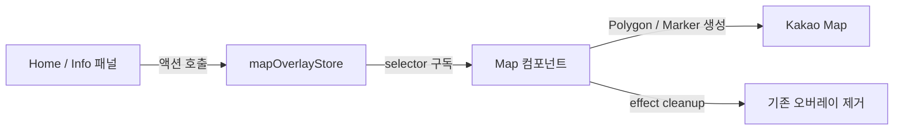

## 들어가며

RentSignal은 왼쪽 패널에서 지역과 지표를 선택하면 오른쪽 Kakao Map이 즉시 반응하는 구조다.

예를 들어 다음과 같은 상호작용이 있다.

- 홈의 추천 지역을 클릭하면 해당 동의 폴리곤을 지도에 표시한다.
- 지하철 접근성 순위를 클릭하면 해당 구를 확대하고 강조한다.
- 정보 탭에서 전월세 지수, 안전도, 편의시설을 선택하면 지도 오버레이가 변경된다.
- 프로필과 추천 페이지는 동일한 로그인 사용자 정보를 사용한다.

이 상태를 각 컴포넌트의 `useState`와 props만으로 관리하면 패널, 레이아웃, 지도 사이에 긴 props 전달 구조가 생긴다. RentSignal에서는 이런 문제를 줄이기 위해 Zustand를 사용했다.

현재 프로젝트의 Zustand 스토어는 크게 두 가지다.

| 스토어 | 역할 |
| --- | --- |
| `userStore` | 로그인 사용자 정보 조회, 저장, 초기화 |
| `mapOverlayStore` | 지도에 표시할 폴리곤, 마커, 노선, 선택 지역 관리 |

## Zustand를 선택한 이유

이 프로젝트에서 필요한 전역 상태 관리는 복잡한 비즈니스 로직보다 **멀리 떨어진 컴포넌트 사이의 상태 공유**에 가깝다.

Zustand는 다음 이유로 현재 구조에 잘 맞았다.

1. 별도의 Provider 없이 어디서든 스토어를 사용할 수 있다.
2. 상태와 액션을 하나의 파일에 간결하게 정의할 수 있다.
3. selector를 사용해 필요한 상태만 구독할 수 있다.
4. TypeScript 타입을 스토어 계약으로 활용하기 쉽다.
5. 지도처럼 React 외부 객체를 제어할 때 명령을 전달하는 중간 계층으로 사용하기 좋다.

프로젝트에서는 `zustand@5`와 React 19를 사용하고 있다.

## 전체 데이터 흐름

지도 관련 상태는 패널 컴포넌트가 변경하고, `Map` 컴포넌트가 이를 구독하여 실제 Kakao Map 객체에 반영한다.



핵심은 Zustand에 Kakao Map 인스턴스나 폴리곤 객체 자체를 저장하지 않는다는 점이다.

스토어에는 아래처럼 **지도에 무엇을 표현할지 설명하는 직렬화 가능한 데이터**를 저장한다.

```ts
export type ConvenienceMapPin = {
  name: string;
  latitude: number;
  longitude: number;
};

export type SubwayLinePolyline = {
  lineName: string;
  color?: string;
  path: {
    latitude: number;
    longitude: number;
  }[];
};
```

실제 `kakao.maps.Polygon`, `kakao.maps.Marker` 등의 객체는 `Map` 컴포넌트의 ref에서 관리한다.

## 1. 사용자 상태 관리

`userStore`는 사용자 정보와 사용자 정보를 갱신하는 액션을 함께 관리한다.

```ts
interface User {
  name: string;
  imageUrl: string;
  role: string;
}

interface UserStore {
  user: User | null;
  fetchUser: () => Promise<void>;
  clearUser: () => void;
}

export const useUserStore = create<UserStore>((set) => ({
  user: null,

  fetchUser: async () => {
    const profile = await getMyProfile();
    set({ user: profile });
  },

  clearUser: () => set({ user: null }),
}));
```

### 비동기 액션을 스토어에 둔 이유

`fetchUser` 내부에서 사용자 조회 API를 호출하고 결과를 바로 저장한다. 사용하는 컴포넌트는 API 응답 구조나 저장 방식을 알 필요가 없다.

```ts
const user = useUserStore((state) => state.user);
const fetchUser = useUserStore((state) => state.fetchUser);
const clearUser = useUserStore((state) => state.clearUser);
```

이 패턴은 다음 화면에서 재사용된다.

- `Profile`: 사용자 정보를 표시하고 로그아웃 시 상태를 초기화한다.
- `Recommend`: 사용자 권한을 확인해 로그인 또는 휴대전화 인증 모달을 연다.
- `PhoneModal`: 인증 완료 후 사용자 정보를 다시 조회한다.

로그아웃 흐름도 단순하다.

```ts
const handleLogout = async () => {
  await logout();
  clearUser();
  navigate("/");
};
```

서버의 로그아웃 처리와 클라이언트 사용자 상태 초기화를 분리하면서도, UI에서는 하나의 명확한 흐름으로 사용할 수 있다.

## 2. 지도 오버레이 상태 관리

`mapOverlayStore`는 사용자 인터페이스와 지도 사이의 통신 채널 역할을 한다.

대표 상태는 다음과 같다.

| 상태 | 지도 표현 |
| --- | --- |
| `rentIndexItems` | 전월세 지수 오버레이 |
| `consumerIndexItem` | 소비자 심리지수 권역 폴리곤 |
| `subwayIndexItems` | 구별 지하철 역세권 지수 |
| `safetyIndexItems` | 구별 안전도 오버레이 |
| `selectedHomeRecommendationName` | 홈 추천 동 폴리곤 |
| `selectedHomeSubwayRanking` | 홈 지하철 순위 구 폴리곤 |
| `selectedTransportNeighborhoodName` | 선택한 교통 추천 동 |
| `subwayLinePolylines` | 지하철 노선 |
| `subwayStationMarkers` | 지하철역 마커 |
| `conveniencePins` | 편의시설 위치 마커 |

스토어 액션 이름은 `set`, `select`, `clear`로 역할을 구분했다.

```ts
setSubwayIndexItems: (items) => set({ subwayIndexItems: items }),
clearSubwayIndexItems: () => set({ subwayIndexItems: [] }),

selectTransportNeighborhood: (name) =>
  set({ selectedTransportNeighborhoodName: name }),
clearSelectedTransportNeighborhood: () =>
  set({ selectedTransportNeighborhoodName: null }),
```

이름만 보아도 목록 전체를 설정하는지, 하나를 선택하는지, 상태를 정리하는지 알 수 있다.

## 3. 패널에서 지도에 명령 전달하기

홈의 추천 지역 카드를 클릭하면 컴포넌트가 직접 Kakao Map을 조작하지 않는다. 대신 선택한 지역명을 스토어에 저장한다.

```ts
const selectHomeRecommendation = useMapOverlayStore(
  (state) => state.selectHomeRecommendation,
);

<RecommendationCard
  neighborhoodName={recommendation.dongName}
  onClick={() => selectHomeRecommendation(recommendation.dongName)}
/>
```

`Map` 컴포넌트는 선택 상태만 구독한다.

```ts
const selectedHomeRecommendationName = useMapOverlayStore(
  (state) => state.selectedHomeRecommendationName,
);
```

상태가 바뀌면 effect에서 GeoJSON을 기준으로 폴리곤을 생성하고 지도를 이동한다.

```ts
useEffect(() => {
  if (!isMapReady || !mapRefInstance.current) return;

  drawSelectedHomeRecommendationPolygon(
    mapRefInstance.current,
    selectedHomeRecommendationName,
  );

  return () => {
    clearSelectedHomeRecommendationPolygons();
  };
}, [isMapReady, selectedHomeRecommendationName]);
```

이 구조 덕분에 패널은 **무엇을 선택했는지**만 알고, 지도는 **어떻게 그릴지**만 책임진다.

## 4. 상호 배타적인 선택 상태

홈에서는 추천 동 폴리곤과 지하철 순위 구 폴리곤이 동시에 남아 있으면 사용자에게 혼란을 줄 수 있다.

이를 컴포넌트에서 각각 정리하지 않고 스토어 액션에서 처리했다.

```ts
selectHomeRecommendation: (name) =>
  set({
    selectedHomeRecommendationName: name,
    selectedHomeSubwayRanking: null,
  }),

selectHomeSubwayRanking: (item) =>
  set({
    selectedHomeSubwayRanking: item,
    selectedHomeRecommendationName: null,
  }),
```

추천 지역을 선택하면 지하철 순위 선택이 해제되고, 지하철 순위를 선택하면 추천 지역 선택이 해제된다.

이처럼 서로 영향을 주는 상태는 액션 내부에서 함께 변경하면 UI 컴포넌트마다 동일한 정리 로직을 반복하지 않아도 된다.

## 5. selector로 필요한 상태만 구독하기

스토어 전체를 가져오는 대신 각 컴포넌트가 필요한 값이나 액션만 selector로 구독한다.

```ts
const conveniencePins = useMapOverlayStore(
  (state) => state.conveniencePins,
);

const clearConveniencePins = useMapOverlayStore(
  (state) => state.clearConveniencePins,
);
```

이 방식의 장점은 다음과 같다.

- 컴포넌트의 의존성이 코드에 명확하게 드러난다.
- 관련 없는 상태 변경으로 인한 렌더링을 줄일 수 있다.
- 테스트하거나 리팩터링할 때 사용하는 상태 범위를 빠르게 파악할 수 있다.

특히 여러 지도 기능을 한 컴포넌트에서 처리하는 현재 구조에서는 선택적 구독이 중요하다.

## 6. 화면 상태와 전역 상태를 구분하기

모든 상태를 Zustand에 넣지는 않았다.

예를 들어 API 로딩 여부, 에러 메시지, 현재 탭처럼 특정 화면에서만 사용하는 상태는 로컬 `useState`로 관리한다.

```ts
const [isLoading, setIsLoading] = useState(false);
const [errorMessage, setErrorMessage] = useState("");
const [currentRankings, setCurrentRankings] = useState([]);
```

반면 조회 결과를 지도에서도 사용해야 할 때만 필요한 데이터 형태로 변환해 전역 스토어에 전달한다.

```ts
const rankings = await fetchRentIndexRankings(residenceType);

setCurrentRankings(rankings);
setRentIndexMapItems(
  rankings.map((item) => ({
    ...item,
    type: "CURRENT",
  })),
);
```

정리하면 기준은 다음과 같다.

- 한 컴포넌트 안에서만 필요하다면 `useState`
- 서로 멀리 떨어진 패널과 지도에서 공유한다면 Zustand
- URL로 표현해야 하는 화면 상태라면 React Router
- 서버 캐시, 재시도, stale 관리가 중요하다면 서버 상태 라이브러리 검토

Zustand를 모든 상태의 저장소로 사용하지 않고, 컴포넌트 경계를 넘는 클라이언트 상태에 집중했다.

## 7. cleanup이 중요한 이유

지도 오버레이는 React DOM 요소가 아니기 때문에 컴포넌트가 사라진다고 자동으로 제거되지 않는다.

따라서 상태를 초기화하는 것과 실제 Kakao Map 객체를 제거하는 작업이 모두 필요하다.

### 스토어 상태 정리

```ts
useEffect(() => {
  return () => clearSubwayIndexMapItems();
}, [clearSubwayIndexMapItems]);
```

### 지도 객체 정리

```ts
const clearSubwayIndexOverlays = () => {
  subwayIndexOverlaysRef.current.forEach((overlay) => {
    overlay.setMap(null);
  });

  subwayIndexOverlaysRef.current = [];
};
```

```ts
useEffect(() => {
  drawSubwayIndexOverlays(mapRefInstance.current, subwayIndexItems);

  return () => {
    clearSubwayIndexOverlays();
  };
}, [isMapReady, subwayIndexItems]);
```

이 cleanup이 빠지면 탭을 이동하거나 다른 지역을 선택했을 때 이전 폴리곤과 마커가 지도에 계속 남을 수 있다.

## 8. Zustand를 사용하며 얻은 효과

### Props drilling 제거

패널에서 발생한 클릭 이벤트를 `MainLayout`을 거쳐 `Map`까지 전달할 필요가 없어졌다.

### UI와 지도 구현 분리

패널은 선택 상태를 만들고, 지도는 해당 상태를 시각화한다. 두 영역의 책임이 분리됐다.

### 지도 기능 확장 용이

새로운 지도 기능을 추가할 때 아래 흐름으로 확장할 수 있다.

1. 스토어에 표현 데이터를 위한 타입과 상태를 추가한다.
2. 상태를 변경하는 액션과 초기화 액션을 추가한다.
3. 패널에서 액션을 호출한다.
4. `Map`에서 상태를 구독하고 effect로 오버레이를 그린다.
5. effect cleanup에서 기존 지도 객체를 제거한다.

### 상태 변화 추적 용이

`selectHomeRecommendation`, `setConveniencePins`처럼 도메인이 드러나는 액션명을 사용해 어떤 사용자 행동이 지도 변경으로 이어지는지 파악하기 쉬워졌다.

## 9. 현재 구조에서 개선할 점

현재 방식은 잘 동작하지만 기능이 늘면서 `mapOverlayStore`와 `Map.tsx`가 커지고 있다.

### 지도 도메인별 slice 분리

다음처럼 역할별 slice로 나누는 방식을 고려할 수 있다.

```text
mapOverlayStore
├── homeOverlaySlice
├── rentIndexOverlaySlice
├── transportOverlaySlice
├── safetyOverlaySlice
└── convenienceOverlaySlice
```

하나의 스토어를 유지하더라도 타입과 액션 생성 로직을 파일별로 나누면 변경 범위를 줄일 수 있다.

### 전체 초기화 액션 추가

라우트 이동 시 여러 clear 액션을 각각 호출하는 대신 아래와 같은 액션을 둘 수 있다.

```ts
clearAllMapOverlays: () =>
  set({
    rentIndexItems: [],
    subwayIndexItems: [],
    safetyIndexItems: [],
    selectedHomeRecommendationName: null,
    selectedHomeSubwayRanking: null,
    conveniencePins: [],
  });
```

다만 모든 화면 전환에서 전체 초기화가 필요한 것은 아니므로, 실제 라우트 정책을 정한 뒤 도입하는 편이 좋다.

### 서버 상태와 클라이언트 상태 분리

현재 `userStore`의 `fetchUser`는 API 호출과 전역 상태 저장을 함께 처리한다. 규모가 커져 캐싱, 중복 요청 제거, 재시도가 필요해지면 TanStack Query 같은 서버 상태 도구와 역할을 나눌 수 있다.

이 경우 Zustand는 로그인 사용자 스냅샷이나 UI 선택 상태를 담당하고, 서버 응답 캐시는 Query가 담당하게 된다.

### 지도 렌더링 훅 분리

`Map.tsx`의 effect와 draw 함수가 계속 늘어난다면 아래처럼 기능별 훅으로 분리할 수 있다.

```text
useHomeMapOverlay
useRentIndexMapOverlay
useTransportMapOverlay
useConvenienceMapOverlay
```

Zustand 구독과 Kakao Map 객체 생명주기를 기능 단위로 묶으면 `Map` 컴포넌트는 지도 초기화와 조합에 집중할 수 있다.

## 마무리

RentSignal에서 Zustand는 단순한 전역 변수 저장소보다 **패널의 사용자 선택을 지도 렌더링 명령으로 전달하는 연결 계층**에 가깝다.

이번 구조에서 중요했던 원칙은 다음과 같다.

1. 스토어에는 Kakao Map 객체가 아니라 표현에 필요한 데이터를 저장한다.
2. 컴포넌트는 selector로 필요한 상태만 구독한다.
3. 화면 전용 상태와 전역 공유 상태를 구분한다.
4. 상호 배타 상태는 스토어 액션에서 함께 처리한다.
5. 상태 초기화와 지도 객체 cleanup을 모두 구현한다.

Zustand의 장점은 코드가 짧다는 데만 있지 않다. 어떤 상태가 컴포넌트 경계를 넘어야 하는지 정하고, 상태를 만드는 영역과 사용하는 영역의 책임을 분리할 때 가장 큰 효과를 얻을 수 있었다.

## 관련 코드

- `src/store/userStore.ts`
- `src/store/mapOverlayStore.ts`
- `src/components/Map.tsx`
- `src/pages/Home.tsx`
- `src/pages/Profile.tsx`
- `src/pages/Recommend.tsx`
- `src/components/Info/InfoSection.tsx`
- `src/hooks/useRentIndexRankings.ts`
- `src/hooks/useConsumerIndex.ts`
